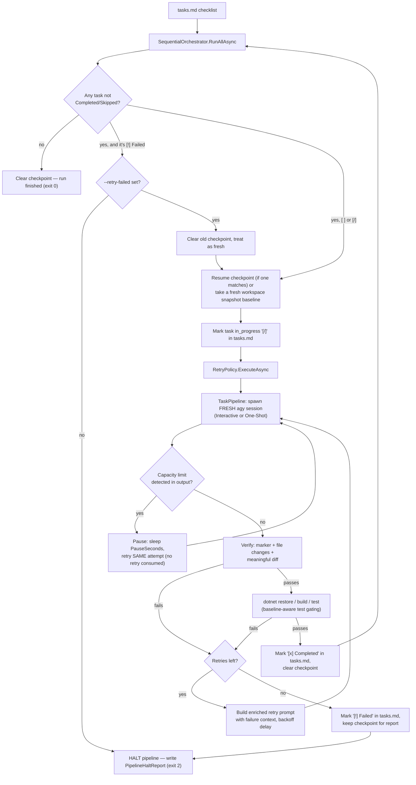
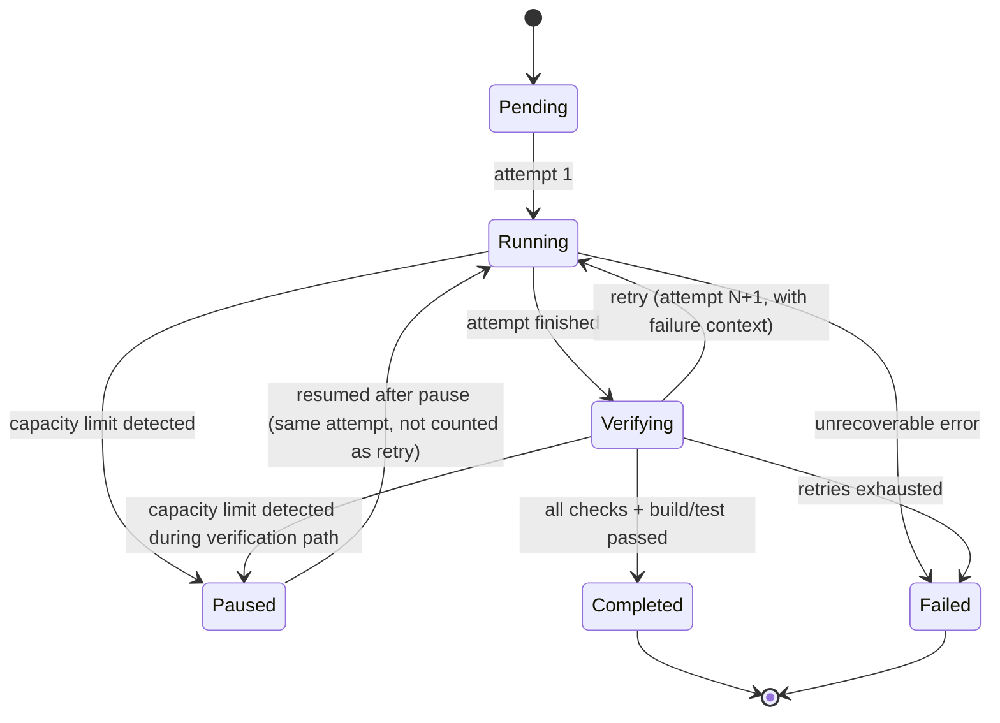

# Antigravity Task Runner

**Unattended, verified, crash-recoverable task orchestration for the Antigravity CLI (`agy`).**

Antigravity Task Runner is a .NET 8 console application that drives the Antigravity CLI (`agy`) through a Markdown checklist (`tasks.md`) **one task at a time**. Each task gets a brand-new `agy` session, a focused prompt, and a multi-stage verification pass (completion marker → real file changes → meaningful implementation diff → build → tests) before the checklist is updated and the runner moves on. If anything fails, the pipeline **halts** rather than skipping the task, and the full state is checkpointed so a crash, a Ctrl+C, or an AI rate limit can be resumed exactly where it left off.

This document is the canonical reference for installing, configuring, running, and extending the project. A much longer narrative write-up — architecture deep dive, sequence diagrams, security/performance considerations, and a full module-by-module tour — lives in [`docs/Project-Guide.md`](docs/Project-Guide.md).

> **Status:** early-stage personal project (2 commits at the time of writing), licensed under the [MIT License](LICENSE). See [Known Limitations & Audit Notes](#known-limitations--audit-notes) before relying on it.

---

## Table of Contents

1. [Project Overview](#project-overview)
2. [Features](#features)
3. [Prerequisites](#prerequisites)
4. [Installation](#installation)
5. [Configuration](#configuration)
6. [Running the Project](#running-the-project)
7. [Available Run Modes](#available-run-modes)
8. [Example Workflow](#example-workflow)
9. [Project Structure](#project-structure)
10. [Architecture Overview](#architecture-overview)
11. [Troubleshooting](#troubleshooting)
12. [FAQ](#faq)
13. [Contributing](#contributing)
14. [License](#license)
15. [Known Limitations & Audit Notes](#known-limitations--audit-notes)

---

## Project Overview

### What this project is

Antigravity Task Runner (assembly name `AntigravityTaskRunner`, CLI name `antigravity`) is a **task orchestration engine for AI coding agents**. You give it a `tasks.md` file containing a GitHub-style checkbox checklist of development work. It reads the first unfinished item, spins up a completely fresh `agy` CLI session inside a pseudo-terminal, sends a prompt asking the agent to complete *only* that one task, watches the session until the agent signals completion, and then independently verifies that real work actually happened before ticking the box and moving to the next item.

### Why it exists / what problem it solves

Pointing a long-running AI coding agent at a big backlog and leaving it unattended sounds appealing, but a naive "keep prompting the same session" loop has several failure modes in practice:

- **Context pollution** — a single long-lived session accumulates irrelevant history from earlier tasks, which measurably degrades output quality on later ones.
- **Unverifiable completion** — an agent can *say* "done" without having changed any code, or make only cosmetic edits (comments, formatting, documentation).
- **No crash recovery** — killing the process, a network blip, or a host reboot loses all progress with no way to resume from where it stopped.
- **Rate limits end the run** — token/quota/context-window limits are indistinguishable from real failures to a naive loop, so the whole run dies instead of pausing and retrying later.
- **Silent skipping hides problems** — a scheduler that skips a task it can't complete and moves on buries the one signal an operator actually needs to see.

Antigravity Task Runner is built specifically to close these gaps for **unattended / overnight / CI-like autonomous coding runs**.

### Why this approach is different

| Naive "loop and re-prompt" automation | Antigravity Task Runner |
|---|---|
| One long session reused across tasks | A brand-new, isolated `agy` session per task, torn down (process tree killed) before the next one starts |
| Trusts the agent's own "I'm done" claim | Independently verifies: completion marker **and** real file changes **and** a *meaningful* (non-cosmetic) diff **and** a passing build/test run |
| A crash loses all progress | Every state transition is checkpointed atomically (`.antigravity/checkpoint.json` + a workspace snapshot); a resumed run continues the exact same task, attempt, and baseline |
| Rate limits look like failures | Capacity-limit output patterns are detected explicitly and **pause** execution (no retry consumed) instead of failing the task |
| A stuck task is skipped so the run "succeeds" | A task that exhausts its retries marks itself `[!]` and **halts the entire pipeline** with a full report; nothing is ever silently skipped |
| Retries repeat the same prompt | Every retry prompt is enriched with the previous failure's verification report, build/test output tail, and which files were/weren't touched |

### High-level architecture

```
┌─────────────────────────────────────────────────────────────────────┐
│                          Runner.Console (exe)                       │
│   Program.cs → Generic Host + Spectre.Console.Cli → RunCommand      │
│   OrchestratorHostedService → live progress UI, summary tables      │
└───────────────────────────────┬───────────────────────────────────-─┘
                                 │
┌────────────────────────────────▼──────────────────────────────────--┐
│                          Runner.Core (orchestration)                │
│  SequentialOrchestrator → TaskStateMachine → RetryPolicy →           │
│  TaskPipeline → PromptTemplateEngine, CompletionVerifier,            │
│  JsonCheckpointStore, ProgressTracker, CancellationManager           │
└──────┬───────────────────┬────────────────────┬──────────────────---┘
       │                   │                    │
┌──────▼──────---┐  ┌───────▼────────---┐ ┌──────▼───────────---┐
│ Runner.Markdown │  │  Runner.Terminal  │ │   Runner.Logging    │
│ tasks.md parser │  │ PTY session mgmt, │ │ Console + JSON file │
│ & writer        │  │ build/test        │ │ logger (aggregated) │
│                 │  │ validation,       │ │                     │
│                 │  │ workspace diffing │ │                     │
└─────────────────┘  └───────────────────┘ └──────────────────---┘
                                 │
                        ┌────────▼─────────┐
                        │ Runner.Configuration │
                        │ strongly-typed options │
                        │ bound from appsettings.json │
                        └──────────────────┘
```

Six projects in `src/`, each with a matching test project in `tests/` (`Runner.Configuration`, `Runner.Console`, `Runner.Core`, `Runner.Logging`, `Runner.Markdown`, `Runner.Terminal`). See [Project Structure](#project-structure) for what each one owns.

---

## Features

Every item below was verified directly against the source in `src/`, not inferred from naming or comments alone.

- **Strictly sequential task execution.** At most one `agy` session is ever alive (`SequentialOrchestrator`); the next task cannot start until the current one is fully verified and its process tree is confirmed dead. There is no parallel/concurrent execution mode in the current code (see [Known Limitations](#known-limitations--audit-notes) for a discrepancy in the project's own historical changelog on this point).
- **Fresh, isolated CLI session per task.** Each attempt spawns a new pseudo-terminal (`Quick.PtyNet`) and a new `agy` process; the whole process tree is force-killed (`taskkill /T /F` on Windows) and reaped before the method returns, so sessions never overlap or leak into the next task.
- **Two execution modes.** `Interactive` (default — drives a live `agy` REPL session over stdin/stdout) and `OneShot` (`--one-shot` — launches `agy -p "<prompt>" --approve all` and takes completion from the real process exit code, the most reliable signal available).
- **Multi-stage completion verification.** A task only counts as done when *all* of the following pass: a `TASK_COMPLETED` marker was observed (ANSI-escape-aware, echo-resistant so the prompt's own instruction text can never be mistaken for the agent's output), the workspace actually changed (SHA-256 content hashing, not timestamps), at least one change is a *meaningful* implementation change (comment/whitespace-normalized hashing rejects formatting-only or documentation-only edits), and `dotnet restore && dotnet build && dotnet test` succeed.
- **Baseline-aware test gating.** Before the very first task of a run, the runner captures which tests are *already* failing. A task is only blocked by **new** failing tests (regressions); pre-existing red tests are reported but never deadlock the pipeline. Configurable via `Build.FailOnlyOnNewTestFailures`.
- **Intelligent, context-rich retries.** Every retry prompt is built from the previous attempt's `FailureKind`, the specific verification checks that failed, a tail of the build/test output, and exactly which files were (and weren't) modified — plus failure-specific corrective guidance text.
- **Exponential backoff.** Configurable base/max backoff seconds, optional jitter, capped attempt count (`Retry.MaxRetries`).
- **Capacity-limit detection and pausing.** Output is scanned for ~19 configurable rate-limit/quota/context-overflow substrings. A match **pauses** the task (checkpointed, no retry consumed) for `Limits.PauseSeconds`, up to `Limits.MaxPausesPerTask` consecutive pauses, then resumes the *same* attempt.
- **Fail-stop, never fail-skip.** A task that exhausts retries is marked `[!]` in `tasks.md` and the entire pipeline halts with a structured `PipelineHaltReport` (failure reason, full retry history, verification report, build output, and a failure-specific suggested next action). The next run refuses to go past that task unless you pass `--retry-failed`.
- **Crash recovery via checkpointing.** The active task, workflow state, attempt number, in-flight prompt, model, modified-files list, full attempt history, and the pre-task workspace snapshot are written atomically (temp file + rename) to `.antigravity/` inside the workspace after every transition. A killed or interrupted run resumes the exact same task, attempt, and baseline.
- **Deterministic, hash-based change detection.** `WorkspaceDetectStrategy.Hash` (default) compares SHA-256 content hashes rather than timestamps, with rename detection (a deleted file whose hash matches a newly-created file is reported as a rename, not a delete+create).
- **Automatic model verification/switching.** Detects the CLI's currently active model from its own output and issues a `/model` switch if it doesn't match `ModelConfig.TargetModel`.
- **Live terminal UI.** A Spectre.Console progress bar plus per-phase status text (AI processing heartbeat with elapsed time and output size, verification, build, test, pause/resume) so the console never appears frozen during long AI turns, followed by a final summary table and a failed-tasks table.
- **Structured, dual-sink logging.** Every log entry goes to both a color-coded console sink and a JSON-lines file sink (`logs/task_<TaskId>.log`, one file per task plus one for the orchestrator itself), fanned out through an `AggregateTaskLogger`.
- **Fully declarative configuration.** Every behavior above is controlled from `appsettings.json` (`Runner` section) with fail-fast `IValidateOptions<RunnerOptions>` validation at startup, plus CLI flags that override specific settings for a single run.
- **`tasks.md` is never edited by the agent.** The prompt explicitly instructs the agent not to touch the tasks file; only the runner ever writes to it, using an atomic read-modify-write with file-lock retry.
- **Dry-run mode.** Parses and lists all pending tasks without starting a single agent session, build, or file write.
- **Graceful Ctrl+C shutdown.** `CancellationManager` intercepts `Console.CancelKeyPress`, preventing immediate process termination so the current attempt can be checkpointed before exiting (exit code `130`).

---

## Prerequisites

| Requirement | Why it's needed | How to install | How to verify |
|---|---|---|---|
| **.NET SDK 8.0+** | The entire solution targets `net8.0` (set globally in `Directory.Build.props`); you need the SDK to restore, build, test, and run. | [Download from dotnet.microsoft.com](https://dotnet.microsoft.com/download) | `dotnet --version` should print `8.x` or higher |
| **.NET SDK 10.0** (see note) | Three of the five test projects (`Runner.Console.Tests`, `Runner.Logging.Tests`, `Runner.Terminal.Tests`) explicitly set `<TargetFramework>net10.0</TargetFramework>` in their `.csproj`, while everything else in the solution targets `net8.0`. A machine with only the .NET 8 SDK **cannot** restore/build those three test projects. | [Download from dotnet.microsoft.com](https://dotnet.microsoft.com/download) | `dotnet --list-sdks` should show a `10.x` entry |
| **Windows** | The runner is Windows-only in practice today: the default shell is `cmd.exe`, process-tree teardown shells out to `taskkill /T /F` (a no-op on non-Windows — see [Known Limitations](#known-limitations--audit-notes)), the PTY layer is forced into `winpty` mode, and only `win-x64`/`win-x86` native PTY binaries are present in the build output. | Windows 10/11 | — |
| **The Antigravity CLI (`agy`)** | This is the actual coding agent the runner drives. Without it on `PATH` (or pointed to via `Terminal.AgentCommand`), no task can ever run. | See [antigravitylab.net](https://antigravitylab.net/) for installation instructions specific to that tool. | Run `agy` (or your configured `AgentCommand`) directly in a terminal and confirm it starts and reaches its `? for shortcuts` ready state. |
| **`agy` authenticated ahead of time** | For unattended runs, the runner cannot answer any interactive login prompt. | Authenticate once manually per `agy`'s own instructions, and/or set `GEMINI_API_KEY` / `ANTIGRAVITY_API_KEY` in the environment. | Run `agy` manually once in the target workspace and confirm no login prompt appears. |
| **Git** | To clone the repository (not otherwise used by the runner itself at build/run time). | [git-scm.com](https://git-scm.com/) | `git --version` |

> **Security note:** the runner launches `agy` with `--dangerously-skip-permissions` in interactive mode and `--approve all` in one-shot mode, and it auto-accepts the CLI's own "Do you trust the contents of this project?" prompt. This is deliberate — an unattended pipeline cannot stop to wait for a human "yes" — but it means the agent runs with **no per-action human confirmation** against whatever `Workspace.WorkspacePath` you point it at. Only run this against workspaces you are comfortable letting an AI agent modify autonomously (ideally version-controlled, ideally an isolated/disposable checkout).

---

## Installation

1. **Clone the repository.**

   ```sh
   git clone https://github.com/dhamo003/agy-task-orchestrator.git
   cd agy-task-orchestrator
   ```

2. **Install the required SDKs** (see [Prerequisites](#prerequisites)). Verify both are visible to the tooling:

   ```sh
   dotnet --list-sdks
   ```

   You should see both an `8.x` and a `10.x` entry. If you only see `8.x`, restoring `tests/Runner.Console.Tests`, `tests/Runner.Logging.Tests`, and `tests/Runner.Terminal.Tests` will fail — install the .NET 10 SDK as well, or build only the `src/` projects (see step 4).

3. **Install and authenticate the Antigravity CLI (`agy`)** per its own documentation, and confirm it runs standalone in the directory you intend to use as a workspace.

4. **Restore NuGet packages.**

   ```sh
   dotnet restore AntigravityTaskRunner.slnx
   ```

   If you deliberately do not have the .NET 10 SDK and only want the product itself (not its full test suite), restore the individual project instead:

   ```sh
   dotnet restore src/Runner.Console/Runner.Console.csproj
   ```

5. **Build the solution.**

   ```sh
   dotnet build AntigravityTaskRunner.slnx -c Debug
   ```

6. **Verify the installation** by running the test suite (skip if you only restored the single project above):

   ```sh
   dotnet test AntigravityTaskRunner.slnx
   ```

   You should see 5 test projects execute with all tests passing (155 `[Fact]`/`[Theory]` test methods at the time of writing — some `[Theory]` methods run multiple data-driven cases, so the reported total will be somewhat higher). The suite runs entirely against mocks and temp directories; it never spawns a real `agy` process and requires no network access or API key.

7. **Do a dry run against a real workspace** to confirm end-to-end wiring without touching any files:

   ```sh
   dotnet run --project src/Runner.Console -- --workspace "C:\path\to\your\project" --tasks "C:\path\to\your\project\tasks.md" --dry-run
   ```

   This should print the parsed task list and exit — no `agy` session is started, and no files are modified.

---

## Configuration

All configuration lives under the `Runner` section of `src/Runner.Console/appsettings.json` (copied next to the built executable on every build). CLI flags (see [Available Run Modes](#available-run-modes)) override the corresponding setting for a single run without editing the file. Every option below is bound to a strongly-typed record/class in `src/Runner.Configuration/` and validated at startup by `RunnerOptionsValidator` — invalid configuration fails fast before any task runs.

### Top-level (`Runner`)

| Key | Default | Meaning |
|---|---|---|
| `TasksFile` | `"tasks.md"` | Path to the checklist file (relative to the working directory, or absolute). |
| `Model` | `"gemini 3.5 flash (high)"` | Target model name used both for prompt building and model-switch detection. |
| `DryRun` | `false` | Parse and list tasks without executing anything. |
| `Verbose` | `false` | Accepted for future use; **currently has no effect on runtime behavior** — see [Known Limitations](#known-limitations--audit-notes). |
| `WorkspacePath` | `"."` | Root directory the agent operates in and the workspace analyzer watches. |
| `RetryFailedTasks` | `false` | When true, a task previously marked `[!]` is retried fresh on startup instead of halting the pipeline. |

### `Retry`

| Key | Default | Meaning |
|---|---|---|
| `MaxRetries` | `3` | Additional attempts after the first (so 4 total attempts by default). |
| `BackoffBaseSeconds` | `5` | Base delay; actual delay = `BackoffBaseSeconds × 2^(attempt-1)`, capped at `BackoffMaxSeconds`. |
| `BackoffMaxSeconds` | `300` | Backoff ceiling. |
| `UseJitter` | `false` | Adds ±20% random jitter when true. Off by default so unattended runs stay deterministic. |

### `Timeout`

| Key | Default | Meaning |
|---|---|---|
| `TaskTimeoutMinutes` | `30` | Hard ceiling for a single attempt (interactive monitoring or one-shot process wait). |
| `SessionTimeoutMinutes` | `60` | Ceiling for the whole terminal session (must be ≥ `TaskTimeoutMinutes`). |
| `ModelSwitchTimeoutSeconds` | `30` | Ceiling for a model-switch operation. |
| `MinPromptProcessingSeconds` | `15` | Minimum time after sending the prompt before the idle-footer heuristic is trusted (interactive mode). |
| `IdleSilenceTimeoutSeconds` | `15` | Seconds of output silence required before the idle footer is accepted as "done" without an explicit marker. |
| `SessionTeardownSeconds` | `30` | Upper bound for killing the process tree and waiting for OS reap before teardown gives up (safety net only). |

### `ModelConfig`

| Key | Default | Meaning |
|---|---|---|
| `TargetModel` | `"gemini 3.5 flash (high)"` | Model the runner tries to keep the session on. |
| `FallbackModels` | `[]` | Reserved for future fallback logic (not currently consumed anywhere in the pipeline). |
| `AutoSwitchEnabled` | `true` | Whether to issue a `/model` switch when the detected model doesn't match. |
| `SwitchCommandTemplate` | `"--model {model}"` | Validated to contain the `{model}` placeholder; not actually used by the current `CliModelSwitcher`, which sends the interactive `/model` menu command instead — see [Known Limitations](#known-limitations--audit-notes). |

### `Workspace`

| Key | Default | Meaning |
|---|---|---|
| `WorkspacePath` | `"."` | **Must be kept in sync with the top-level `WorkspacePath`** — `RunCommand` does this automatically for the CLI `--workspace` flag. |
| `SolutionFile` | `null` | Optional explicit solution file (not currently read by the build validator, which auto-detects `.sln`/`.slnx`/`.csproj`). |
| `DetectStrategy` | `"Hash"` | `Hash` (SHA-256 content, default), `Timestamp`, `Both`, or `None`. |
| `IncludePatterns` | `["**/*"]` | Glob include patterns for the snapshot scan. |
| `ExcludePatterns` | `bin/`, `obj/`, `.git/`, `.vs/`, `node_modules/`, `logs/`, `.antigravity/` | Glob exclude patterns. |

### `PromptTemplate`

| Key | Default | Meaning |
|---|---|---|
| `Template` | See `appsettings.json` | Supports `{task}`, `{taskLine}`, `{lineNumber}`, `{tasksFile}`, `{workspace}`, `{workspaceContext}` (expands to a file listing), and any custom key in `Variables`. |
| `Prefix` / `Suffix` | `""` | Text prepended/appended to the built prompt. |
| `Variables` | `{}` | Custom `{key}` substitutions. |

### `Completion`

| Key | Default | Meaning |
|---|---|---|
| `SuccessMarkers` | `["TASK_COMPLETED"]` | Standalone-line markers indicating success. |
| `FailureMarkers` | `["TASK_FAILED"]` | Standalone-line markers indicating explicit agent-reported failure. |
| `TimeoutMarkers` | `["timed out", "timeout"]` | Reserved output markers for timeout phrasing (matching is primarily driven by the real timeout clock, not these strings). |
| `CaseInsensitive` | `true` | Marker matching case sensitivity. |

### `Terminal`

| Key | Default | Meaning |
|---|---|---|
| `ShellPath` | `"cmd.exe"` | Shell used for interactive-mode sessions. |
| `Arguments` | `"/K"` | Shell startup arguments. |
| `EnvironmentVariables` | `{}` | Extra environment variables for the spawned process. |
| `ExecutionMode` | `"Interactive"` | `Interactive` or `OneShot` — see [Available Run Modes](#available-run-modes). |
| `AgentCommand` | `"agy"` | Executable used to launch the agent (interactive mode appends `--dangerously-skip-permissions` in code; one-shot mode uses `OneShotArguments`). |
| `OneShotArguments` | `["-p", "{prompt}", "--approve", "all"]` | Argv template for one-shot mode; supports `{prompt}`, `{model}`, `{workspace}`, `{tasksFile}`; empty-resolving elements are dropped. |

### `Verification`

| Key | Default | Meaning |
|---|---|---|
| `SourceExtensions` | `.cs, .csproj, .sln, .slnx, .props, .targets, .json, .xml, .razor, .cshtml, .ts, .tsx, .js, .jsx, .py, .sql, .yaml, .yml` | Extensions counted as implementation files. |
| `DocumentationExtensions` | `.md, .markdown, .txt, .rst` | Extensions that never count as implementation changes on their own. |
| `IgnoredPathFragments` | `/bin/, /obj/, /.git/, /.vs/, /node_modules/, /logs/, /.antigravity/, runner-state.json, .cache` | Path fragments excluded from verification entirely. |
| `IgnoredExtensions` | `.dll, .pdb, .exe, .log, .suo, .user, .baml, .ide` | Extensions excluded entirely (build/tool noise). |
| `RequireMeaningfulDiff` | `true` | Reject attempts whose only changes are comment/whitespace-normalized-identical. |
| `RequireCompletionMarker` | `true` | Require the `TASK_COMPLETED` marker to have been observed. |

### `Build`

| Key | Default | Meaning |
|---|---|---|
| `Enabled` | `true` | Master switch for the whole build/test validation stage. |
| `SkipWhenNoProject` | `true` | Skip (not fail) when no `.sln`/`.slnx`/`.csproj` is found in the workspace. |
| `RunTests` | `true` | Run the `test`-named stage when test projects exist. |
| `FailOnlyOnNewTestFailures` | `true` | Baseline-aware gating — only new (regression) test failures block a task. |
| `Commands` | `restore` → `build --no-restore` → `test --no-build` | Ordered validation stages; each has its own `TimeoutMinutes`. |
| `MaxCapturedOutputChars` | `20000` | Output truncation limit per stage in reports/retry prompts. |

### `Limits`

| Key | Default | Meaning |
|---|---|---|
| `LimitPatterns` | ~19 substrings (`rate limit exceeded`, `quota exceeded`, `resource_exhausted`, `context length exceeded`, `http 429`, …) | Case-insensitive output substrings that trigger a pause. |
| `PauseSeconds` | `300` | Wait time before resuming the same task after a limit is detected. |
| `MaxPausesPerTask` | `12` | Consecutive-pause ceiling before the pipeline gives up and halts. |

### `Checkpoint`

| Key | Default | Meaning |
|---|---|---|
| `Enabled` | `true` | Master switch for checkpoint persistence. |
| `Directory` | `".antigravity"` | Relative (to workspace) or absolute checkpoint directory. |
| `CheckpointFileName` | `"checkpoint.json"` | Execution state file. |
| `SnapshotFileName` | `"workspace-snapshot.json"` | Pre-task workspace baseline file. |

---

## Running the Project

All commands below assume **Windows** with a `cmd.exe` or PowerShell terminal open at the repository root (`agy-task-orchestrator\`), which is required regardless of which shell you personally use to *launch* `dotnet`, because the runner's own default `Terminal.ShellPath` is `cmd.exe`. Linux and macOS are **not currently supported** — see [Prerequisites](#prerequisites) and [Known Limitations](#known-limitations--audit-notes) for exactly why.

### Run from source (recommended during setup/iteration)

```sh
dotnet run --project src/Runner.Console -- --workspace "B:\MyProjects\SomeRepo" --tasks "B:\MyProjects\SomeRepo\tasks.md"
```

What this does: `dotnet run` restores/builds `Runner.Console` (and its project references) if needed, then launches it. Everything after the bare `--` is passed straight through to the application's own CLI parser (Spectre.Console.Cli), **not** interpreted by `dotnet run` itself — this is why the `--` separator is required.

### Run the built executable directly

```sh
dotnet build AntigravityTaskRunner.slnx -c Release
cd src\Runner.Console\bin\Release\net8.0
AntigravityTaskRunner.exe --workspace "B:\MyProjects\SomeRepo" --tasks "B:\MyProjects\SomeRepo\tasks.md"
```

### Publish a standalone deployable copy

```sh
dotnet publish src/Runner.Console/Runner.Console.csproj -c Release -o publish
cd publish
AntigravityTaskRunner.exe --workspace "B:\MyProjects\SomeRepo"
```

This is a framework-dependent publish (no `RuntimeIdentifier`/self-contained flags are set in the `.csproj`), so the target machine still needs the .NET 8 runtime installed.

### What actually happens when you run it

1. `Program.cs` builds a Generic Host, registers every project's DI services, and wraps the host in a Spectre `CommandApp<RunCommand>` so `--help`, argument parsing, and validation errors are handled uniformly.
2. `RunCommand` applies your CLI flags on top of `appsettings.json` (CLI wins), then builds and runs the host.
3. `OrchestratorHostedService` starts a live progress UI and calls into `SequentialOrchestrator.RunAllAsync`, which is where the actual task loop described in [Architecture Overview](#architecture-overview) happens.
4. The process exits with a code described in [Available Run Modes](#available-run-modes).

There are no IDE launch profiles (`launchSettings.json`) checked into the repository — the commands above are the supported way to start the app either from an IDE's "run external tool" configuration or a plain terminal.

---

## Available Run Modes

The runner has **two mutually-exclusive execution modes** (how the agent CLI is driven) and **several CLI flags** that modify behavior for a single run. All are verified against `RunSettings.cs` / `RunCommand.cs` — no other modes exist in the current source, regardless of what any historical planning document might suggest (see [Known Limitations](#known-limitations--audit-notes)).

### Execution mode: Interactive (default)

- **Purpose:** drive a live, persistent `agy` REPL session exactly the way a human would type into it.
- **When to use it:** this is the default and the best-tested path; use it unless you have a specific reason to prefer real-process-exit semantics.
- **Command:** no flag needed (or explicitly `--one-shot` omitted).
- **Expected behavior:** spawns `cmd.exe`, `cd`s into the workspace, launches `agy --dangerously-skip-permissions`, waits for the `? for shortcuts` ready banner (auto-accepting any "Do you trust this project?" prompt), verifies/switches the model, sends the task prompt over stdin, then polls output every second looking for a standalone `TASK_COMPLETED`/`TASK_FAILED` line. If no marker appears, an idle-footer heuristic (sustained output silence **and** the ready footer visible again) is used as a fallback completion signal after `Timeout.MinPromptProcessingSeconds`.
- **Advantages:** works with `agy`'s normal interactive UX; the model-switch and trust-prompt handling only apply here.
- **Limitations:** completion detection is heuristic when the agent doesn't print the marker cleanly; slightly more moving parts than one-shot mode.

### Execution mode: One-Shot (`--one-shot`)

- **Purpose:** run each task as a single non-interactive `agy` invocation and take completion from the **real OS process exit code** — the most unambiguous signal available.
- **When to use it:** when `agy`'s print/one-shot mode (`agy -p "<prompt>" --approve all` by default) is reliable in your environment and you want the strongest completion signal.
- **Command:** `--one-shot`
- **Expected behavior:** spawns `agy` directly (no intermediate shell, no shell quoting — arguments are passed as a real argv list) with the fully-resolved one-shot argument template, waits for the process to exit on its own, then still runs the same marker-detection pass over the captured output for logging/verification purposes.
- **Advantages:** no idle-footer guessing; no model-switch step (not applicable — there is no persistent session to switch mid-flight).
- **Limitations:** depends on `agy`'s one-shot/print mode existing and behaving the way `OneShotArguments` assumes; less visibility into intermediate agent "thinking" in the live UI.

### CLI flags (single-run modifiers)

| Flag | Effect |
|---|---|
| `-w, --workspace <PATH>` | Workspace root the agent operates in and the analyzer watches. Defaults to the current directory. |
| `-t, --tasks <FILE>` | Path to the tasks checklist. Defaults to `tasks.md`. |
| `-m, --model <MODEL>` | Overrides the configured target model for this run. |
| `--dry-run` | Parses and prints every pending task; starts no session, runs no build, writes no files. |
| `--retry-failed` | Treats a task previously marked `[!]` as retryable (clears its checkpoint and re-attempts fresh) instead of halting the pipeline on it. |
| `--no-build-validation` | Disables the entire `dotnet restore/build/test` stage. **Not recommended** for unattended runs — a task can then be marked complete on marker + file-change evidence alone. |
| `-v, --verbose` | Parsed and stored, but **currently has no observable effect** on console verbosity or logging — see [Known Limitations](#known-limitations--audit-notes). File logs already capture full `Trace`-level detail (including raw terminal output) regardless of this flag. |

### Exit codes

| Code | Meaning |
|---|---|
| `0` | All tasks completed successfully. |
| `1` | Defined for "run finished with some failed tasks recorded." In the current fail-stop design this is effectively unreachable in practice — any single task failure triggers an immediate pipeline halt (code `2`) within the same run, before a second task could ever be attempted. |
| `2` | Pipeline halted on an unrecoverable failure, or an unhandled exception occurred. |
| `130` | Run was cancelled (Ctrl+C). |

---

## Example Workflow



A crash or Ctrl+C at any point in the `RetryPolicy` / `TaskPipeline` box resumes, on the next launch, from the exact checkpointed state (same task, same attempt number, same baseline snapshot) rather than restarting the whole run.

---

## Project Structure

```
agy-task-orchestrator/
├── AntigravityTaskRunner.slnx     # Solution file (new XML .slnx format)
├── Directory.Build.props         # Shared TFM/langversion/analysis settings for all projects
├── README.md                     # This file
├── tasks.md                      # This project's OWN development checklist (dogfooded)
├── docs/
│   └── Project-Guide.md          # Long-form architecture & usage guide
├── src/
│   ├── Runner.Configuration/     # Strongly-typed options + fail-fast validation
│   ├── Runner.Markdown/          # tasks.md parser/writer, task/phase models, JSON state
│   ├── Runner.Terminal/          # PTY sessions, build/test validation, workspace diffing,
│   │                             #   completion/limit/model detection
│   ├── Runner.Core/              # Orchestration: state machine, retry, pipeline, checkpointing,
│   │                             #   prompt templating, verification, progress tracking
│   ├── Runner.Logging/           # ITaskLogger + console/file/aggregate implementations
│   └── Runner.Console/           # The executable: composition root, CLI, live UI, appsettings.json
└── tests/
    ├── Runner.Configuration.Tests/   # (referenced by Core.Tests; see Runner.Core.Tests below)
    ├── Runner.Console.Tests/     # End-to-end + CLI command tests (targets net10.0)
    ├── Runner.Core.Tests/        # Orchestrator, pipeline, retry, checkpoint, state machine tests
    ├── Runner.Logging.Tests/     # Logger tests (targets net10.0)
    ├── Runner.Markdown.Tests/    # Parser/writer/state tests
    └── Runner.Terminal.Tests/    # Build validator, completion/limit detector, workspace tests (targets net10.0)
```

At runtime, the running executable additionally creates:

- **`logs/`** next to the executable (or working directory) — one JSON-lines file per task ID (`task_T-<line>.log`) plus `task_Orchestrator.log` for orchestrator-level events.
- **`.antigravity/`** inside the **workspace** (not the runner's own directory) — `checkpoint.json` and `workspace-snapshot.json` for crash recovery. Both are already excluded from the workspace's own change-detection scan.

> Note: `tests/Runner.Configuration.Tests` is not a real project — configuration validation is actually tested from within `Runner.Core.Tests/RunnerOptionsValidatorTests.cs` and `ConfigurationServiceExtensionsTests.cs`. Listed here only to clarify there is no separate test project for that assembly.

---

## Architecture Overview

### Components and data flow

- **`Runner.Console`** is the composition root and the only project with an entry point. `Program.cs` wires all six projects' DI registrations into one `IHostBuilder`, then hands CLI parsing to Spectre.Console.Cli's `CommandApp<RunCommand>`. `OrchestratorHostedService` (an `IHostedService`) is what actually kicks off orchestration when the host starts, and it owns the live progress UI by subscribing to `IProgressTracker` events.
- **`Runner.Core`** is the brain. `SequentialOrchestrator` owns the outer "pick next task, run it, halt-or-continue" loop. For each task, `RunSingleAsync` wraps a `TaskStateMachine` (enforcing legal `Pending → Running → Verifying → Completed/Failed`, with `Paused` as a side-state reachable from `Running`) around calls into `IRetryPolicy.ExecuteAsync`, which itself calls `ITaskPipeline.ExecuteAsync` once per attempt.
- **`Runner.Terminal`** does the actual work of one attempt: `IAgentSessionRunner` (either `InteractiveAgentRunner` or `OneShotAgentRunner`) drives a fresh `ITerminalSession` (`ProcessTerminalSession`, backed by `Quick.PtyNet`), `ILimitDetector` scans for capacity limits, `IWorkspaceAnalyzer` snapshots and diffs the workspace, and `IBuildValidator` runs the configured `dotnet` stages.
- **`Runner.Markdown`** is the only code that ever reads or writes `tasks.md`. `MarkdownTaskParser` extracts `TaskPhase`/`TaskItem` records from the checkbox syntax; `MarkdownTaskWriter` performs a locked read-modify-write to flip a single line's marker.
- **`Runner.Logging`** provides `ITaskLogger`, always resolved as an `AggregateTaskLogger` fanning out to a `ConsoleTaskLogger` (Info+ by default) and a `FileTaskLogger` (Trace+, one JSON-lines file per task ID).
- **`Runner.Configuration`** has no runtime logic beyond `RunnerOptionsValidator` — it is purely the typed shape of `appsettings.json` plus DI registration glue, consumed by every other project via `IOptions<T>`.

### Task lifecycle (finite-state machine)



`TaskStateMachine` (in `Runner.Core/Workflow/`) enforces this table in code — an illegal transition throws `InvalidOperationException` rather than silently corrupting state, turning workflow bugs into loud failures during development.

### Error handling & retry

Every attempt result is classified into one `FailureKind`: `AgentReportedFailure`, `MarkerMissing`, `NoChanges`, `NoMeaningfulChanges`, `BuildFailed`, `TestsFailed`, `Timeout`, `SessionFailure`, `CapacityLimit`, or `Exception` (plus `None` for success). `RetryContext.BuildGuidance()` turns that classification into failure-specific corrective text injected into the next prompt (e.g. "the previous attempt introduced NEW failing tests — fix the specific assertions listed above" vs. "no files were changed — you must modify real project source files"). `CapacityLimit` is handled entirely differently by `RetryPolicy`: it pauses and retries the **same** attempt without incrementing the retry counter, up to a configurable consecutive-pause ceiling.

### Session management

Sessions are created and torn down entirely within `IAgentSessionRunner.RunAsync` — callers never see a session outlive one attempt. Teardown (`AgentSessionTeardown.ShutdownAsync`) always calls `KillAsync` (which force-kills the *entire* process tree via `taskkill /T /F` on Windows, not just the root shell — necessary because `agy` and any tools it spawns are separate child processes) followed by a bounded wait for the real OS exit event, guaranteeing the next task's session can never overlap the previous one.

### Logging

Every log entry is a single JSON object: `{"timestamp", "level", "scope": {"taskId", "taskName", "attemptNumber"}, "message", "exception"}`. Because the interactive runner logs raw terminal output chunks at `Trace` level (`[TERMINAL OUTPUT] ...`, including ANSI escape codes), per-task log files can grow to hundreds of KB to low-single-digit MB for a chatty session — this is expected and is your primary debugging tool when a task's classification is surprising.

### State management

Two independent persistence mechanisms exist, serving different purposes:

- **`ExecutionCheckpoint`** (`Runner.Core/Checkpointing/JsonCheckpointStore`) is the one actually used by `SequentialOrchestrator` for crash recovery — task identity, workflow state, attempt count, prompt, model, modified files, full attempt history, and the pre-task test baseline, written atomically to `.antigravity/checkpoint.json` plus a paired `workspace-snapshot.json`.
- **`RunnerState`/`JsonStateManager`** (`Runner.Markdown/State/`) is a simpler, older-looking `runner-state.json` mechanism (last task line, timestamp, attempt) that is registered in DI (`AddMarkdownEngine`) but **not called from anywhere in the current orchestration path** — `SequentialOrchestrator` uses `ICheckpointStore` exclusively. Treat `IStateManager` as effectively vestigial today (see [Known Limitations](#known-limitations--audit-notes)).

For a much deeper walkthrough — including full sequence diagrams for the retry-with-context path, the capacity-limit pause/resume path, and the crash-recovery path — see [`docs/Project-Guide.md`](docs/Project-Guide.md).

---

## Troubleshooting

**Build failure: `NETSDK1045` or "it was not possible to find any installed .NET Core SDKs"**
*Symptom:* `dotnet build`/`dotnet restore` fails immediately, often naming `net10.0`.
*Root cause:* one or more of `Runner.Console.Tests`, `Runner.Logging.Tests`, `Runner.Terminal.Tests` targets `net10.0`, but only the .NET 8 SDK is installed.
*Solution:* install the .NET 10 SDK alongside .NET 8 (`dotnet --list-sdks` should show both), or build/test only the individual projects that target `net8.0` (all of `src/`, plus `Runner.Core.Tests` and `Runner.Markdown.Tests`).

**"'agy' is not recognized as an internal or external command"**
*Symptom:* every task immediately fails with `SessionFailure` / "Timed out waiting for the agent CLI to become ready."
*Root cause:* the Antigravity CLI isn't on `PATH`, or `Terminal.AgentCommand` points to the wrong executable name/path.
*Solution:* confirm `agy` runs manually from the same terminal/user context the runner will use; if it's not on `PATH`, set `Terminal.AgentCommand` in `appsettings.json` to its full path.

**Every task fails at the build stage even though the code looks fine**
*Symptom:* `FailureKind.BuildFailed` with unrelated-looking compiler errors, or `TestsFailed` with tests you didn't expect to run.
*Root cause:* `Build.Commands` runs against `Workspace.WorkspacePath`, not the runner's own repository — confirm you pointed `--workspace` at the *target* project, not `agy-task-orchestrator` itself. Also check whether the target workspace already fails to build/test *before* any task ran — the baseline capture step logs this explicitly (`"the workspace does not build BEFORE any task ran"`).
*Solution:* fix the pre-existing build error in the target workspace first, or point `--workspace` correctly.

**A task keeps getting marked `NoChanges` / `NoMeaningfulChanges` even though the agent seemed to do something**
*Symptom:* `FailureKind.NoChanges` or `NoMeaningfulChanges` on every retry.
*Root cause:* the agent only edited files matched by `Verification.DocumentationExtensions`, only changed comments/whitespace in a source file (rejected by the normalized-hash check), or edited files under an `IgnoredPathFragments` path.
*Solution:* clarify the task wording so it clearly requires a code change, or check the per-task log file (`logs/task_T-<line>.log`) for the `MeaningfulImplementationDiff` verification line listing exactly which files were seen and why they didn't count.

**The pipeline halted and won't continue on subsequent runs**
*Symptom:* every run immediately reports the same task as blocked, exit code `2`.
*Root cause:* this is by design — a task marked `[!]` blocks the pipeline until resolved, so a real problem is never silently skipped.
*Solution:* read the halt report's "Suggested next action" (printed to console and in the task's log), fix the underlying issue (or edit the task yourself and mark it `[x]`/`[-]` by hand), then either re-run normally or with `--retry-failed` to have the runner re-attempt it fresh.

**Runs seem to "hang" for 5+ minutes with no visible progress**
*Symptom:* the live status line stops updating with an AI-processing heartbeat.
*Root cause:* likely a capacity-limit pause (`Limits.PauseSeconds`, default 300s = 5 minutes) — check the log for `"[workflow] Pause — capacity limit detected"`.
*Solution:* this is expected behavior, not a hang; wait for the pause to elapse (up to `Limits.MaxPausesPerTask` times), or lower `Limits.PauseSeconds` / adjust `Limits.LimitPatterns` if it's a false positive.

**Orphaned `agy`/`conhost`/`winpty-agent` processes remain after stopping the runner**
*Symptom:* Task Manager shows leftover agent processes after a forced kill of the runner itself (e.g. `taskkill` on the runner's own PID from Task Manager, or a host crash).
*Root cause:* teardown (`taskkill /T /F` on the session's process tree) only runs as part of the runner's own normal shutdown path; killing the *runner* process itself from the outside skips that cleanup.
*Solution:* prefer Ctrl+C (which the runner intercepts for graceful shutdown) over killing the process externally; manually end any leftover child processes if this does happen.

**Configuration validation error at startup**
*Symptom:* the app exits immediately with a list of validation failure messages (e.g. `"Retry.BackoffMaxSeconds must be >= BackoffBaseSeconds"`).
*Root cause:* `RunnerOptionsValidator` runs fail-fast validation across every options section before any task executes.
*Solution:* the message names the exact field and constraint violated — fix the corresponding value in `appsettings.json`.

**`--verbose` doesn't seem to change anything**
*Symptom:* console output looks identical with or without `-v`.
*Root cause:* verified in source — this flag is parsed and stored but not read anywhere else in the codebase today.
*Solution:* use the per-task JSON log files in `logs/` (already `Trace`-level) for full detail; there is currently no way to raise console verbosity specifically.

---

## FAQ

**Does this work with agent CLIs other than Antigravity's `agy`?**
Not out of the box. `Terminal.AgentCommand` lets you point at a different executable name/path, and the one-shot argument template is configurable, but the interactive path hardcodes `agy`-specific assumptions (the `--dangerously-skip-permissions` flag, the `? for shortcuts` ready-banner string, the `/model` switch command, and a fixed list of known Gemini/Claude/GPT-OSS model name strings for detection). Substituting a different CLI would require changes to `InteractiveAgentRunner`, `CliModelSwitcher`, and `OutputModelDetector`.

**Can I run multiple tasks in parallel to go faster?**
No — this is an intentional design constraint, not a missing feature. Exactly one `agy` session is ever alive by design, so that verification always compares against an unambiguous single-attempt baseline. See [Known Limitations](#known-limitations--audit-notes) for a note on why the project's own historical task list briefly suggests otherwise.

**What happens if I edit `tasks.md` by hand while the runner is running?**
The runner re-parses the file at the start of every loop iteration (not once at startup), so hand-edits between tasks are picked up. Editing the line the runner is *actively* attempting is unsupported and may be overwritten on the next status update — avoid it.

**How do I make a task "give up" and move on instead of halting the pipeline?**
You can't, by design — that is the entire point of the fail-stop guarantee. If a task genuinely can't be completed by the agent, mark it `[-]` (skipped) yourself in `tasks.md`, or `[x]` if you finish it manually.

**Where do I see exactly what the agent typed/saw?**
`logs/task_T-<lineNumber>.log`, one JSON-lines file per task, containing every log entry including raw (ANSI-included) terminal output chunks at `Trace` level.

**Does deleting `.antigravity/` reset anything meaningful?**
It deletes the crash-recovery checkpoint and baseline snapshot for whatever task was in flight — the next run will treat that task as brand new (fresh workspace baseline) rather than resuming an in-progress attempt. It has no effect on `tasks.md` itself.

**Why does the tool need `--dangerously-skip-permissions` / `--approve all`?**
Because it's built for unattended operation — there's no human present to answer the CLI's own per-action confirmation prompts. See the security note in [Prerequisites](#prerequisites).

---

## Contributing

There is no `CONTRIBUTING.md`, issue template, or CI workflow in the repository at the time of writing. Until those exist, the practical workflow is:

1. **Fork** the repository on GitHub (`https://github.com/dhamo003/agy-task-orchestrator`).
2. **Clone** your fork and create a branch for your change.
3. **Build**: `dotnet build AntigravityTaskRunner.slnx`.
4. **Test**: `dotnet test AntigravityTaskRunner.slnx` — all 5 test projects should pass. Add or update tests alongside any behavioral change; the existing suite uses **xUnit** + **FluentAssertions** + **Moq**, entirely mock-driven (no real `agy` process or network access), so new tests should follow the same pattern.
5. **Respect the existing style**: the solution builds with `TreatWarningsAsErrors=true` and `AnalysisLevel=latest-recommended` (see `Directory.Build.props`) — a warning is a build failure. `Nullable` reference types are enabled throughout.
6. **Add a feature**: most new behavior fits into one of the existing extension seams — a new `IAgentSessionRunner` for a different agent CLI, a new `BuildCommandOptions` stage, a new `VerificationCheck` in `CompletionVerifier`, or a new `LimitPatterns` entry. See `docs/Project-Guide.md`'s "Extension Points" section for guidance on each.
7. **Submit a pull request** against the repository with a description of the change and confirmation that `dotnet build` and `dotnet test` both succeed clean.

---

## License

This project is licensed under the **MIT License** — see [`LICENSE`](LICENSE) for the full text.

In short: anyone may use, copy, modify, merge, publish, distribute, sublicense, and even sell copies of this software, for free, for any purpose (including commercial), as long as the original copyright notice and license text are kept in any copy or substantial portion they redistribute. The software is provided *as is*, with no warranty — the copyright holder is not liable for anything that happens as a result of someone else using it.

---

## Known Limitations & Audit Notes

This section exists because the brief for this documentation explicitly asked for undocumented behavior and discrepancies to be surfaced rather than papered over. Every item below was verified directly against the source in this repository as of this writing.

- **`tasks.md`'s own historical checklist claims parallel execution was implemented; it wasn't.** Phase B/F of the repository's own `tasks.md` mark "Define `ParallelOptions` record" and "Implement `ParallelOrchestrator`" as complete (`[x]`). No `ParallelOptions.cs` or `ParallelOrchestrator.cs` exists anywhere in `src/`, and a full-text search for `Parallel` across `src/` and `tests/` returns zero matches. The actual, current design is intentionally sequential-only (confirmed throughout `SequentialOrchestrator` and this document) — treat `tasks.md`'s checklist as a historical planning artifact, not a source of truth about current capability.
- **`--verbose` / `-v` is a no-op.** It is parsed into `RunSettings.Verbose` and copied into `RunnerOptions.Verbose`, but no other code in the repository reads that property. Console logging is hardcoded to `LogLevel.Info` and file logging to `LogLevel.Trace` regardless of this flag.
- **Two test projects target `.NET 10.0` while the rest of the solution targets `.NET 8.0`.** `Runner.Console.Tests`, `Runner.Logging.Tests`, and `Runner.Terminal.Tests` explicitly set `<TargetFramework>net10.0</TargetFramework>`; everything else (all of `src/`, plus `Runner.Core.Tests` and `Runner.Markdown.Tests`) targets `net8.0` via `Directory.Build.props`. This looks like drift rather than an intentional split. A machine with only the .NET 8 SDK cannot build the full test suite.
- **Windows-only in practice, despite .NET 8 being cross-platform.** `TerminalOptions.ShellPath` defaults to `cmd.exe`, `ProcessTerminalSession.KillProcessTreeAsync` explicitly no-ops on non-Windows (`if (!OperatingSystem.IsWindows()) return;`), the PTY layer is started with `ForceWinPty = true`, and only `win-x64`/`win-x86` native PTY binaries ship in the build output. Running on Linux/macOS today would leave orphaned agent child processes behind on every teardown, at minimum.
- **`ModelOptions.SwitchCommandTemplate` (`"--model {model}"`) is validated at startup but not actually used to build the switch command.** `CliModelSwitcher` sends a hardcoded `/model` interactive-menu keystroke sequence instead of formatting `SwitchCommandTemplate`. The setting exists and is enforced to contain `{model}`, but changing its value has no effect on runtime behavior.
- **`ModelOptions.FallbackModels` is defined and validated but never consumed.** There is no fallback-model logic anywhere in `Runner.Terminal` or `Runner.Core`.
- **Two parallel, differently-scoped state-persistence mechanisms exist.** `Runner.Core`'s `ExecutionCheckpoint`/`JsonCheckpointStore` is what `SequentialOrchestrator` actually uses for crash recovery. `Runner.Markdown`'s `RunnerState`/`JsonStateManager` (writing `runner-state.json`) is fully implemented and registered in DI but is not invoked anywhere in the current orchestration path — it appears to be superseded, earlier-generation code left in place.
- **Exit code `1` ("finished with some tasks failed") is defined but effectively unreachable** given the current fail-stop design: the moment any task fails, the pipeline halts (exit code `2`) within the same run, before a second task could exist to make the "some failed, but the run finished" condition true. This isn't necessarily a bug, but the exit-code contract as written implies a scenario the current control flow cannot produce.
- **No `CONTRIBUTING.md`, `CHANGELOG`, `.editorconfig`, `global.json`, or CI workflow (e.g. GitHub Actions) exists in the repository** (a `LICENSE` file — MIT — has been added). The `git` history contains exactly two commits ("Initial commit", "Bug fixes"). Treat this as an early-stage, pre-collaboration codebase.
- **The existing (pre-rewrite) README's claim of "160 tests"** could not be reproduced exactly; a direct count of `[Fact]`/`[Theory]` attributes across all five test projects returns **155**. `[Theory]` methods with multiple `[InlineData]` rows execute more individual test *cases* than this method count, so the true number of test cases `dotnet test` reports at run time is likely higher than 155 — but 155 is the verifiable method count as of this writing.

These are documented here, and referenced from the relevant sections above, rather than silently corrected or omitted — per this documentation's own standard of not asserting behavior that isn't backed by the actual source.
