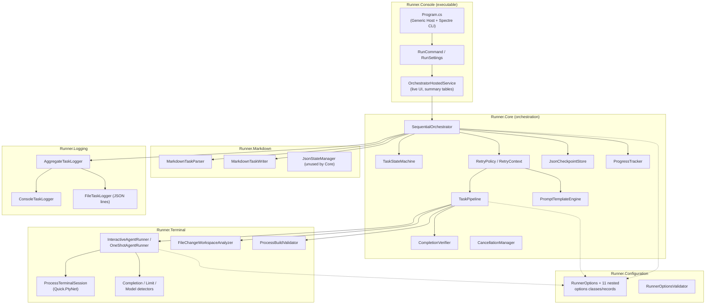
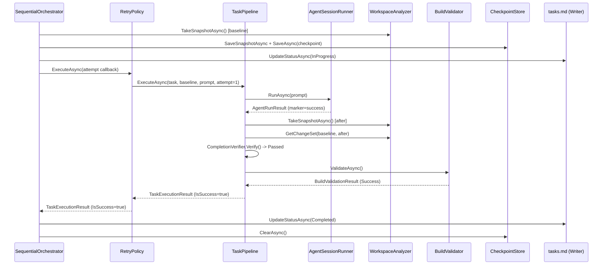
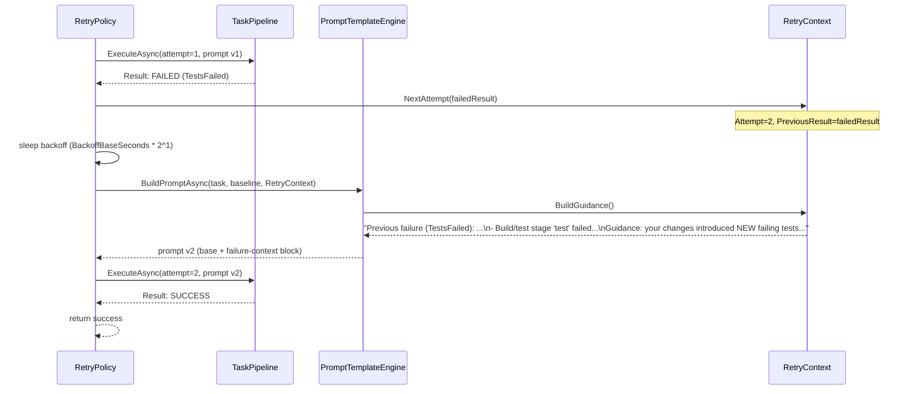
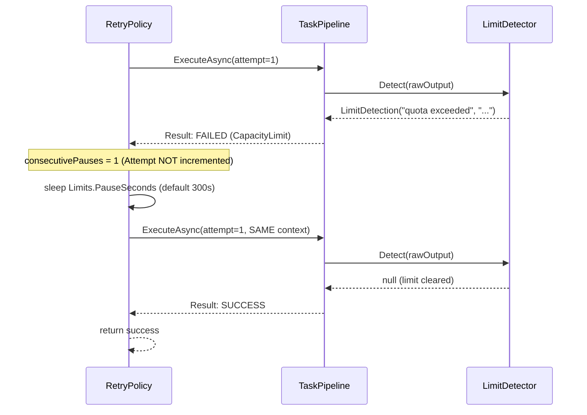
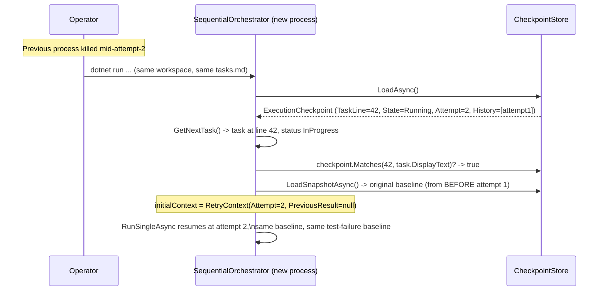

# The Antigravity Task Runner Guide: Building an Unattended, Self-Verifying AI Coding Pipeline

*A complete architectural and operational guide to the Antigravity Task Runner project.*

---

## Table of Contents

1. [Introduction](#1-introduction)
2. [The Real-World Problem](#2-the-real-world-problem)
3. [Traditional Approach vs. This Approach](#3-traditional-approach-vs-this-approach)
4. [Design Decisions](#4-design-decisions)
5. [System Architecture](#5-system-architecture)
6. [The Execution Pipeline](#6-the-execution-pipeline)
7. [Complete Setup Guide](#7-complete-setup-guide)
8. [Configuration Guide](#8-configuration-guide)
9. [Module-by-Module Deep Dive](#9-module-by-module-deep-dive)
10. [Sequence Diagrams](#10-sequence-diagrams)
11. [Session Lifecycle](#11-session-lifecycle)
12. [Task Lifecycle](#12-task-lifecycle)
13. [Error Handling Strategy](#13-error-handling-strategy)
14. [Recovery Strategy](#14-recovery-strategy)
15. [Logging Architecture](#15-logging-architecture)
16. [Extension Points](#16-extension-points)
17. [Best Practices](#17-best-practices)
18. [Performance Considerations](#18-performance-considerations)
19. [Security Considerations](#19-security-considerations)
20. [Limitations](#20-limitations)
21. [Future Roadmap](#21-future-roadmap)
22. [Common Mistakes](#22-common-mistakes)
23. [Frequently Asked Questions](#23-frequently-asked-questions)
24. [Complete Walkthrough](#24-complete-walkthrough)
25. [Conclusion](#25-conclusion)

---

## 1. Introduction

Antigravity Task Runner is a small, dense, single-purpose .NET 8 application. It has one job: take a checklist of software development tasks written in plain Markdown, and drive an AI coding agent — specifically the [Antigravity CLI](https://antigravitylab.net/) (`agy`) — through that checklist, one item at a time, unattended, for hours or days if necessary, without silently skipping a task it couldn't finish and without losing its place if the process dies partway through.

That sentence hides a surprising amount of engineering. "One item at a time" means a state machine and an orchestration loop. "Unattended" means the tool has to make judgment calls a human would normally make — is this actually done? did it actually work? should we try again, or give up, or wait and retry? "For hours or days" means checkpointing, capacity-limit handling, and crash recovery. "Without silently skipping" means a fail-stop design philosophy that runs against the grain of most automation, which usually optimizes for "keep going no matter what."

This guide exists to explain not just *what* the code does — the README already covers that at reference-manual depth — but *why* it's built the way it is, how its pieces fit together end to end, and what you need to know to run it, extend it, or reason about a surprising result it gave you. It is written for a developer who has never seen this codebase before and needs to become productive with it quickly, while still being precise enough to be useful to the person who wrote it.

Everything in this document was verified against the actual source code in `src/` and `tests/` at the time of writing. Where the code does something different from what you might expect from a class or config key's name, that's called out explicitly rather than glossed over — a large part of the value of a document like this is telling you where the implementation and the "obvious" reading of the code diverge.

### Who this project is for

If you already use an AI coding agent CLI interactively — asking it to implement one feature, reviewing the diff, asking for the next — this tool is for the moment you have a *list* of such features, written down, and you'd rather queue the whole list and check back later than sit and drive each one by hand. It assumes:

- You're comfortable letting an AI agent make unsupervised changes to a codebase (ideally one under version control, so any bad change is trivially reversible).
- You're on Windows (see [Limitations](#20-limitations) for exactly why this matters today).
- You have the Antigravity CLI installed and authenticated already.
- Your tasks are small enough that "one AI session, one task, then verify" is the right granularity — this is not a project-scaffolding wizard; it's a checklist executor.

---

## 2. The Real-World Problem

Modern AI coding agents are good enough, often enough, that the bottleneck in using them for a large backlog of small-to-medium tasks isn't *capability* — it's *supervision*. Someone still has to sit there, read each task, kick off the agent, watch it work, decide if it actually finished, and manually check the box before moving to the next item. For a 50-item checklist, that's a full day of a human doing coordination work instead of engineering work.

The obvious fix — write a loop that feeds the agent tasks one after another without a human in the middle — runs into problems fast if you build it naively:

**Context pollution.** Coding agent CLIs like `agy` typically operate as a single ongoing session with accumulated conversational and tool-use history. Feed it task after task in the same session, and by task 20 its context window is full of decisions, files, and reasoning from tasks 1 through 19 that have nothing to do with task 20. This isn't just wasted tokens — it measurably degrades the quality and focus of later responses, and it makes the agent more likely to make changes outside the current task's actual scope.

**Claims aren't proof.** An agent finishing its turn and printing something that looks like "done!" is not evidence that anything useful happened. Agents can misunderstand a task, decide it's already complete, make a documentation-only edit, or simply give up gracefully with output that reads as confident. A supervision loop that trusts the agent's own self-report is trusting the one party in the interaction most likely to be wrong about whether the work is actually finished.

**No memory across a crash.** A naive loop is just a `for` loop in a process. Kill that process — a laptop sleeping, a network blip, a host reboot, an accidental Ctrl+C — and every bit of progress bookkeeping lives only in that process's memory. You're starting over, or worse, you don't know which tasks were actually finished and which only *looked* finished before the crash.

**Rate limits look exactly like real failures.** Every AI provider enforces some combination of requests-per-minute, tokens-per-minute, daily quota, and context-window ceilings. To a loop that doesn't specifically look for these, a 429 response or a "quota exceeded" message is indistinguishable from the agent failing the task — so a fully automated overnight run can, and often does, die at 2 AM on the first rate limit it hits, having made no more progress than if you'd walked away after the first task.

**Skipping hides the one thing you need to see.** The tempting fix for "a task keeps failing" is to log the failure and move to the next task, so the run at least makes *some* progress. This is almost always the wrong instinct for a checklist of real engineering work: a task that can't be completed automatically is usually telling you something — the task is ambiguous, the codebase has a pre-existing problem, the agent needs a capability it doesn't have — and burying that signal under 30 more completed checkboxes means you find out days later, if ever.

Antigravity Task Runner exists because all five of these problems have concrete, implementable solutions, and once you've written the solution to one of them, the others start to look like they belong in the same tool.

---

## 3. Traditional Approach vs. This Approach

| Concern | Traditional / naive automation | Antigravity Task Runner |
|---|---|---|
| Session lifetime | One long session across many tasks | One brand-new session per task, fully torn down before the next starts |
| Completion signal | Trust the agent's own output | Marker **and** real file changes **and** a meaningful (non-cosmetic) diff **and** a green build/test run |
| Crash behavior | Start over from scratch | Resume the exact same task, attempt number, and workspace baseline from an atomically-written checkpoint |
| Rate limits | Indistinguishable from failure; run dies | Explicitly detected; execution **pauses** (no retry consumed) and resumes automatically |
| A task that can't be finished | Skipped, or the whole run crashes | The **entire pipeline halts** with a structured report; nothing is silently skipped |
| Retry prompts | Identical prompt repeated | Enriched with the exact previous failure, verification detail, and build/test output tail |
| Change detection | Often timestamp-based (unreliable, no rename detection) | SHA-256 content hashing, with rename detection and comment/whitespace-normalized "meaningful diff" classification |
| Test gating | Any red test blocks everything, forever, on a repo that already has failing tests | Baseline captured once up front; only **new** (regression) failures block a task |
| Human confirmation prompts | Block the pipeline waiting for input | Deliberately and explicitly auto-answered (with a real security trade-off — see [Security Considerations](#19-security-considerations)) |

The throughline across every row is the same idea: **treat "did this actually work?" as an engineering problem to be solved with evidence, not a social problem to be solved by trusting the agent.** Once you accept that premise, fresh sessions (to get a clean evidence baseline), content hashing (to get a reliable diff), build/test validation (to get the strongest evidence available), and checkpointing (so that evidence-gathering process itself survives a crash) all follow naturally.

---

## 4. Design Decisions

A handful of decisions shape almost everything else in the codebase. Understanding these first makes the rest of the architecture close to self-explanatory.

### 4.1 Fail-stop, not fail-skip

This is the single most opinionated decision in the project, stated plainly in the orchestrator's own doc comments: *"Tasks are never skipped: a permanent failure HALTS the pipeline with a full report instead of moving on."* Every other piece of retry/pause/checkpoint machinery exists in service of making this bearable — because halting on the *first* transient hiccup would be unusable, the system works hard (retries with context, capacity-limit pauses) to make sure a halt only happens when there's a genuine problem worth a human's attention.

### 4.2 Fresh session per task

Rather than one long-lived `agy` session, every single attempt — including retries of the *same* task — gets a brand-new pseudo-terminal and a brand-new agent process. This is more expensive (the agent re-establishes context every time, e.g. reading relevant files again) but it eliminates context pollution entirely and, just as importantly, gives the workspace-diffing verification step an unambiguous, single-attempt window to compare against.

### 4.3 Proof over claims

Completion requires passing four independent checks, described in detail in [Section 13](#13-error-handling-strategy): an explicit marker, any file change at all, at least one *meaningful* file change, and a green build/test run. Each check is deliberately layered so that a fix to one required for another to run — actually running the (relatively expensive) build/test stage is gated behind the workspace already showing meaningful changes, since there's no point compiling a workspace nothing touched.

### 4.4 Deterministic content hashing over timestamps

`WorkspaceOptions.DetectStrategy` defaults to `Hash`. Timestamps are cheap but unreliable — a file can be rewritten with identical content and get a new timestamp (a false positive), or a filesystem/tool can preserve a timestamp across a real edit (a false negative, rarer but possible). SHA-256 content hashing is slower but unambiguous, and it enables a bonus capability: comparing the hash of a deleted file against the hash of a newly-created file lets the analyzer report a **rename** instead of a spurious delete+create pair.

### 4.5 Pause, don't fail, on capacity limits

`RetryPolicy` treats `FailureKind.CapacityLimit` as a completely separate code path from every other failure. A normal failure consumes a retry attempt and waits an exponentially-increasing backoff. A capacity limit consumes **no** retry attempt, waits a fixed configurable pause, and then retries with the *same* attempt context — because a rate limit says nothing about whether the previous attempt's approach was wrong, only that *when* it happened was wrong.

### 4.6 Checkpoint everything, atomically

`JsonCheckpointStore.WriteAtomicAsync` writes to a `.tmp` file and then does an atomic `File.Move(..., overwrite: true)`. This is a small detail with an outsized payoff: a crash mid-write can never leave a half-written, corrupt checkpoint behind — you either have the previous valid checkpoint or the new valid one, never a broken hybrid. `JsonCheckpointStore.ReadAsync` additionally treats a `JsonException` (a corrupt file, however it got that way) as "no checkpoint," rather than crashing the whole application on startup.

### 4.7 Configuration over hardcoding, but not universally

Nearly every threshold, pattern list, and command is configurable via `appsettings.json` — timeouts, backoff curves, capacity-limit substrings, build stages, verification extensions. This is a deliberate bet that the *shape* of the pipeline (fresh session → verify → build/test → retry-or-halt) is stable, while the *specifics* (which model, which build commands, how long to wait) will need tuning per project and per agent CLI version. Notably, this bet is **not** fully realized yet — several agent-CLI-specific behaviors (the `--dangerously-skip-permissions` flag, the `? for shortcuts` ready-banner string, the `/model` switch keystroke sequence) are hardcoded in `InteractiveAgentRunner` rather than configurable, which is worth knowing if you ever try to point this at a different agent CLI. See [Section 20](#20-limitations).

---

## 5. System Architecture

The solution is six projects under `src/`, each with a corresponding test project under `tests/`, wired together entirely through `Microsoft.Extensions.DependencyInjection`.



### 5.1 Project responsibilities at a glance

| Project | Owns | Depends on |
|---|---|---|
| `Runner.Configuration` | The entire typed shape of `appsettings.json`; fail-fast validation | Nothing else in the solution |
| `Runner.Markdown` | Reading and writing `tasks.md`; task/phase models | `Runner.Configuration` |
| `Runner.Logging` | `ITaskLogger` and its three implementations | `Runner.Configuration` |
| `Runner.Terminal` | PTY sessions, agent session runners, workspace diffing, build/test validation, completion/limit/model detection | `Runner.Configuration`, `Runner.Logging` |
| `Runner.Core` | Orchestration: state machine, retry policy, pipeline, checkpointing, prompt templating, verification, progress tracking | `Runner.Configuration`, `Runner.Logging`, `Runner.Markdown`, `Runner.Terminal` |
| `Runner.Console` | The executable; CLI parsing; DI composition root; live terminal UI | All of the above |

This is a clean layered dependency graph — nothing circular, and `Runner.Configuration` sits at the bottom with zero internal dependencies, which is exactly what you want from a shared options library.

### 5.2 Why six projects instead of one

Splitting this small an application into six assemblies might look like over-engineering at first glance, but each boundary maps to something that's genuinely independently testable and independently replaceable: you could swap `Runner.Terminal`'s PTY implementation without touching `Runner.Core`'s orchestration logic (they interact only through `IAgentSessionRunner`, `IWorkspaceAnalyzer`, and `IBuildValidator` interfaces); you could swap `Runner.Markdown`'s checkbox syntax for a different task-list format without touching orchestration (interaction only through `ITaskParser`/`ITaskWriter`); and the test suite structure mirrors this exactly — every project's tests mock its *dependencies'* interfaces rather than reaching into their concrete implementations.

---

## 6. The Execution Pipeline

This section walks the exact code path from process start to process exit, naming the real classes and methods involved at each step.

### 6.1 Startup

`Program.cs` builds a `Microsoft.Extensions.Hosting` generic host and registers all six projects' services onto it (`AddRunnerConfiguration`, `AddTaskLogging`, `AddMarkdownEngine`, `AddTerminalServices`, `AddRunnerCore`), plus a singleton `Spectre.Console.AnsiConsole.Console` and the `OrchestratorHostedService` as an `IHostedService`. Rather than running the host directly, `Program.cs` wraps the *builder* (not yet built) in a `TypeRegistrar`/`TypeResolver` pair and hands it to a Spectre `CommandApp<RunCommand>`. This indirection exists so Spectre.Console.Cli can own argument parsing, `--help` text, and examples, while still deferring host construction until after `RunCommand` has had a chance to layer CLI-flag overrides onto the bound options.

### 6.2 Applying CLI overrides

`RunCommand.ExecuteAsync` receives the parsed `RunSettings` and calls `_hostBuilder.ConfigureServices(...)` to register `PostConfigure<RunnerOptions>` and `PostConfigure<WorkspaceOptions>` callbacks. These run *after* `appsettings.json` binding, so CLI flags always win. This is also where a subtle but important synchronization happens: both the top-level `RunnerOptions.WorkspacePath` and the nested `RunnerOptions.Workspace.WorkspacePath` are set from the same `--workspace` value, because the workspace analyzer reads the nested option while most other code reads the top-level one — a mismatch here would make the verifier watch the wrong directory (a real risk if the runner is launched from inside its own publish folder, called out explicitly in a code comment).

Only then does `RunCommand` call `_hostBuilder.Build()` and `host.RunAsync()`.

### 6.3 Kickoff

`OrchestratorHostedService.StartAsync` registers a callback on `IHostApplicationLifetime.ApplicationStarted` that fires `ExecuteAsync` on a background `Task.Run`. `ExecuteAsync` prints a build timestamp (so a stale published binary is immediately obvious), sets up a Spectre `Progress()` context with five columns (description, bar, percentage, elapsed time, spinner), subscribes to four `IProgressTracker` events (`TaskStarted`, `StatusChanged`, `TaskCompleted`, `PipelineHalted`), and calls `ITaskOrchestrator.RunAllAsync`.

### 6.4 The outer loop — `SequentialOrchestrator.RunAllAsync`

This is the heart of the application. In order:

1. If `RunnerOptions.DryRun` is set, parse `tasks.md` and log every pending task's display text, then return immediately — no session, no build, no checkpoint activity.
2. Otherwise, check for an existing checkpoint and log a message if one exists and isn't `Completed` (informational only at this point).
3. Call `EnsureTestBaselineAsync` — if build validation and test running and baseline-aware gating are all enabled, and no baseline has been captured yet this process, either restore one from a resumed checkpoint or capture a fresh one by running the configured build/test stages once, before any agent work, and recording which tests are already failing.
4. Enter the main `while (!token.IsCancellationRequested)` loop:
   - Re-parse `tasks.md` from disk (not cached — this is what allows hand-edits between tasks to be picked up).
   - `GetNextTask` returns the first task whose status is `NotStarted`, `InProgress`, or `Failed` (in that document order; `Completed` and `Skipped` are passed over).
   - If there is no such task, clear the checkpoint and break — the run is finished.
   - If the next task is `Failed` and `--retry-failed` was **not** passed, build a `TaskExecutionResult`/`PipelineHaltReport` describing that the pipeline refuses to proceed past an unresolved failure, report it, and break.
   - If it *was* passed, clear the stale checkpoint (a retry starts genuinely fresh, not resumed) and fall through to attempt the task.
   - A `HashSet<int> attemptedLines` guards against ever attempting the same line twice within one `RunAllAsync` call — a belt-and-suspenders safety net for the single-active-task guarantee.
   - Call `RunSingleAsync(nextTask, token)` and **await** it fully (this await is itself the single most important line enforcing strict sequencing — the loop provably cannot begin a second task until this call, including its internal session teardown, has returned).
   - If the result was not successful, build a `PipelineHaltReport` from it plus whatever attempt history is in the checkpoint, report it, and break — **fail-stop**, no exception to this rule anywhere in the loop.

### 6.5 The per-task workflow — `SequentialOrchestrator.RunSingleAsync`

1. Construct a `TaskStateMachine` scoped to this task (starts in `Pending`) and report `TaskStarted`/status "Pending — preparing task".
2. Attempt to load an existing checkpoint. It's only honored if it `Matches` this exact task (by line number **and** trimmed display text — matching on display text rather than the raw line means a checkpoint survives the checkbox marker itself changing, e.g. `[ ]` → `[/]`) and its state is a *live* one (`Pending`/`Running`/`Verifying`/`Paused`, not `Failed`/`Completed`, which exist only for reporting). If it matches, also load the paired workspace snapshot — if that's missing (shouldn't normally happen), the checkpoint is discarded and the task starts fresh anyway rather than resuming against an unknown baseline.
3. If no usable checkpoint was found: take a fresh workspace snapshot right now (before any agent call), create a new `ExecutionCheckpoint.Start(...)` — including the test-failure baseline, so a subsequent crash-recovery pass restores the *original* baseline instead of recapturing one polluted by partial agent work — and persist both the snapshot and the checkpoint immediately.
4. Mark the task `InProgress` (`[/]`) in `tasks.md`.
5. Call `IRetryPolicy.ExecuteAsync`, passing an `attempt` callback and an `onAttemptCompleted` callback (used purely for checkpoint bookkeeping and state-machine transitions between attempts — the retry/pause *decision* itself lives entirely in `RetryPolicy`, described next).
6. On terminal success: state machine → `Completed`, write `[x]` to `tasks.md`, clear the checkpoint.
7. On terminal failure (and only if the state machine isn't already terminal, i.e. this codepath is skipped if a capacity-limit ceiling already forced a return through a different path): state machine → `Failed`, write `[!] (Reason: ...)` to `tasks.md`, and **keep** the checkpoint (now in `Failed` state) purely so the halt report and any later `--retry-failed` run still has the attempt history to show.

### 6.6 One attempt — `RetryPolicy.ExecuteAsync` calling into `TaskPipeline.ExecuteAsync`

`RetryPolicy` is a `while (true)` loop, not a bounded `for`, because the capacity-limit pause path needs to be able to loop indefinitely (up to its own separate ceiling) without being confused for a "real" retry. Per iteration:

1. Call the `attempt` callback with the current `RetryContext` (which the orchestrator uses to transition the state machine, build the prompt via `PromptTemplateEngine`, persist the in-flight prompt to the checkpoint, and finally call `TaskPipeline.ExecuteAsync`).
2. `TaskPipeline.ExecuteAsync` is the one-attempt workhorse, described fully in [Section 6.7](#67-one-pipeline-attempt-in-detail).
3. Call `onAttemptCompleted` (checkpoint bookkeeping).
4. If the result succeeded: return it immediately — done.
5. If the result was a `CapacityLimit`: increment a consecutive-pause counter (**separate** from the retry-attempt counter); if it exceeds `Limits.MaxPausesPerTask`, give up and return the failed result (this is the one way a capacity limit can still end in a halt); otherwise sleep `Limits.PauseSeconds` and `continue` the loop **without** advancing `RetryContext.Attempt` — from the pipeline's perspective, this looks like the exact same attempt happening again.
6. If the result was any other failure: reset the pause counter; if `context.Attempt >= maxAttempts` (`Retry.MaxRetries + 1`), give up and return the failed result; otherwise sleep an exponential backoff delay and advance to `context.NextAttempt(result)`, which is what makes the previous failure's detail available to `PromptTemplateEngine` on the next loop iteration.

### 6.7 One pipeline attempt, in detail

`TaskPipeline.ExecuteAsync` runs four stages, stopping at the first one that fails:

1. **Run the agent session.** `IAgentSessionRunner.RunAsync` (either `InteractiveAgentRunner` or `OneShotAgentRunner`, selected once at DI-registration time based on `Terminal.ExecutionMode`) spawns a fresh session, drives it, and — critically — guarantees the session is fully torn down before returning, success or failure. See [Section 11](#11-session-lifecycle) for the full detail of what happens inside this call.
2. **Scan for capacity limits.** Checked *before* anything else about the result, specifically so that a rate-limited attempt is classified as `CapacityLimit` and routed to the pause path rather than being misread as a normal failure by the checks below.
3. **Check for session-level failure or timeout.** If the session runner itself reports `FailureDetail` (e.g. the CLI never reached its ready banner) or `TimedOut`, the attempt fails immediately with `SessionFailure`/`Timeout` — verification and build validation never run, since there's nothing meaningful to verify.
4. **Verify the workspace.** Take a fresh snapshot, diff it against the *original* baseline for this task (not the previous attempt's snapshot — retries accumulate against the same starting point), and run `ICompletionVerifier.Verify`, which checks (a) the agent's own outcome signal, (b) whether anything changed at all, and (c) whether at least one change is *meaningful*. If any check fails, the attempt fails with a `FailureKind` derived from exactly which signal was missing.
5. **Run build/test validation** — only reached if verification passed. `IBuildValidator.ValidateAsync` runs the configured stages (default: `dotnet restore` → `dotnet build --no-restore` → `dotnet test --no-build`), applying baseline-aware test gating if configured. A failing stage fails the attempt with `BuildFailed` or `TestsFailed` depending on which stage.

Only an attempt that clears all four stages returns `IsSuccess = true`.

---

## 7. Complete Setup Guide

This section is deliberately more narrative than the README's reference-style installation steps — it explains *why* each step matters, not just what to type.

### Step 1 — Confirm you're on a supported platform

Before installing anything, understand that this tool is Windows-only in practice today (see [Limitations](#20-limitations) for the exact code-level reasons). If you're on Linux or macOS, you can build and run the unit test suite, but you should not expect the actual agent-driving pipeline to behave correctly — process teardown alone will leave orphaned agent processes running.

### Step 2 — Install both .NET SDKs

Run `dotnet --list-sdks`. You need at least one `8.x` entry (the whole solution's baseline, set in `Directory.Build.props`) and, if you want to build and run the *complete* test suite, at least one `10.x` entry too (three test projects explicitly opt into `net10.0` — see [Section 8](#8-configuration-guide) and [Limitations](#20-limitations)). A single .NET 10 SDK installation satisfies both requirements, since newer SDKs can build older target frameworks; installing only the .NET 8 SDK satisfies only the first.

Why this matters: skipping this step doesn't fail loudly at the point you'd expect. `dotnet build AntigravityTaskRunner.slnx` with only the .NET 8 SDK installed will successfully build every `src/` project and two of the five test projects, then fail specifically on `Runner.Console.Tests`, `Runner.Logging.Tests`, and `Runner.Terminal.Tests` with an SDK-resolution error that doesn't obviously say "install a newer SDK."

### Step 3 — Install and authenticate the Antigravity CLI

This project drives `agy`; it does not replace it. Install it per its own documentation at [antigravitylab.net](https://antigravitylab.net/), and — this is the step people skip and then get confused by — **run it manually, once, in the directory you plan to use as a workspace**, and get all the way through any first-run prompts (trust confirmation, authentication/login) before ever pointing the runner at that directory. The runner's interactive mode does auto-accept the "do you trust this project" prompt, but it does not, and cannot, handle an interactive login flow — if `agy` isn't already authenticated, every task will fail identically and unhelpfully with a "CLI never became ready" session failure.

### Step 4 — Clone and restore

```sh
git clone https://github.com/dhamo003/agy-task-orchestrator.git
cd agy-task-orchestrator
dotnet restore AntigravityTaskRunner.slnx
```

### Step 5 — Build

```sh
dotnet build AntigravityTaskRunner.slnx -c Debug
```

A `Debug` build is fine for iterating; use `-c Release` for anything you'll actually leave running unattended (see [Performance Considerations](#18-performance-considerations)).

### Step 6 — Run the test suite as an installation sanity check

```sh
dotnet test AntigravityTaskRunner.slnx
```

This is the single best signal that your local toolchain matches what the project expects — it needs no network access, no `agy` installation, and no API key, because every test mocks the boundaries (`ITerminalSession`, `IWorkspaceAnalyzer`, `IModelDetector`, and so on) rather than touching the real world.

### Step 7 — Prepare a target workspace and a `tasks.md`

The workspace you point the runner at is a **separate** directory from `agy-task-orchestrator` itself — almost always a different project you actually want the AI agent to work on. That directory needs its own `tasks.md` using the checkbox syntax described in [Section 8](#8-configuration-guide). Start with one or two low-risk tasks the first time, not your whole backlog.

### Step 8 — Dry-run first

```sh
dotnet run --project src/Runner.Console -- --workspace "C:\path\to\target" --tasks "C:\path\to\target\tasks.md" --dry-run
```

This parses and lists tasks without starting a single session or touching a single file — the cheapest possible way to confirm the tool found the right file and parsed it the way you expect (correct phases, correct next-task selection) before it's allowed to do anything real.

### Step 9 — Run for real, watch the first task closely

```sh
dotnet run --project src/Runner.Console -- --workspace "C:\path\to\target" --tasks "C:\path\to\target\tasks.md"
```

Watch the live status line through at least one full task/verification/build cycle before you trust the tool to run unattended. Check the resulting `logs/task_T-<line>.log` file afterward, even on success, to build intuition for what a healthy run's log looks like — you'll want that baseline the first time something looks wrong.

---

## 8. Configuration Guide

Configuration lives in `src/Runner.Console/appsettings.json`, under a single `Runner` root key, bound to `RunnerOptions` and ten nested options classes/records. The README contains a complete field-by-field reference table; this section instead focuses on *how to tune it for different scenarios*, since that's the guidance a reference table can't give you.

### Tuning for a flaky or slow AI backend

Increase `Timeout.TaskTimeoutMinutes` and `Timeout.SessionTimeoutMinutes` together (the validator enforces `SessionTimeoutMinutes >= TaskTimeoutMinutes`) if your model is simply slow to respond, not stuck. Widen `Retry.BackoffMaxSeconds` and consider enabling `Retry.UseJitter` if you expect to run several instances against different workspaces concurrently against the same provider (jitter avoids every instance's backoff timers lining up and hammering the API in lockstep — though note the *tasks within one workspace* are always sequential regardless).

### Tuning for aggressive rate limits

Raise `Limits.PauseSeconds` if you know your quota resets on a longer cycle than the 5-minute default, and raise `Limits.MaxPausesPerTask` proportionally so a single task can wait out a long quota window without giving up. If your provider's error text isn't already covered by the ~19 built-in `Limits.LimitPatterns` substrings, add the exact phrase you're seeing — this is a plain case-insensitive substring match, not a regex, so add the shortest unique fragment of the real message.

### Tuning verification strictness

If your workspace has file types not covered by the default `Verification.SourceExtensions` list (for example `.go`, `.rb`, or `.tf` files), add them — otherwise a real implementation change in one of those files will be invisible to the "meaningful diff" check and every task touching only such files will fail as `NoMeaningfulChanges`. Conversely, if a generated-file path in your workspace keeps causing false-positive "changes," add its fragment to `Verification.IgnoredPathFragments` rather than disabling `RequireMeaningfulDiff` globally.

### Tuning test gating

The default `Build.FailOnlyOnNewTestFailures = true` is almost always what you want for a real-world codebase that already has some red tests — the alternative (`false`, strict mode) means a repository can never successfully complete *any* task until every pre-existing failing test is fixed first, which is rarely the actual goal of a task-by-task automation run. Switch to strict mode only for a codebase you know starts 100% green and where you want zero tolerance for any regression, however small.

### Tuning for a non-.NET workspace

`Build.Commands` defaults to `dotnet restore`/`build`/`test`, which is obviously specific to .NET projects. Point it at whatever your workspace actually uses — for example `npm ci`, `npm run build`, `npm test`, or `pytest`. `Build.SkipWhenNoProject` only auto-detects `.sln`/`.slnx`/`.csproj` files, so for a non-.NET workspace you likely also want to set it to `false` (so a missing project file doesn't silently skip validation) once you've pointed `Commands` at the right tool for that ecosystem.

### Tuning the prompt itself

`PromptTemplate.Template` is the single biggest lever over agent behavior available to you without touching code. The default template is deliberately narrow ("Complete ONLY that task... print TASK_COMPLETED") to discourage scope creep; if you find the agent frequently over-reaching into unrelated files, tighten the wording further (e.g. explicitly listing which files are in-scope via `{workspaceContext}`); if you find it frequently declaring success prematurely, add explicit self-verification instructions to the template before the completion-marker instruction.

---

## 9. Module-by-Module Deep Dive

### 9.1 `Runner.Configuration`

The quietest project in the solution and, in a sense, the most important — every other project depends on it, and it has zero runtime logic beyond validation. `RunnerOptions` is the root: a single mutable class with a `TasksFile`, `Model`, `DryRun`, `Verbose`, `WorkspacePath`, and `RetryFailedTasks`, plus ten nested options objects (`Retry`, `Timeout`, `ModelConfig`, `Workspace`, `PromptTemplate`, `Completion`, `Terminal`, `Verification`, `Build`, `Limits`, `Checkpoint` — eleven, actually, once you count `Checkpoint`). `ConfigurationServiceExtensions.AddRunnerConfiguration` binds each nested section independently (so each can also be resolved standalone via `IOptions<T>` by any consumer that only needs one slice) and registers `RunnerOptionsValidator` as an `IValidateOptions<RunnerOptions>` — which the .NET Options framework invokes automatically the first time `IOptions<RunnerOptions>.Value` is accessed, meaning a configuration mistake surfaces as an immediate startup exception rather than a confusing runtime symptom hours into a run.

Note the two enums living directly in this project: `WorkspaceDetectStrategy` (`Timestamp`/`Hash`/`Both`/`None`) and `TerminalExecutionMode` (`Interactive`/`OneShot`) — both are simple enough that they're defined inline rather than in their own files elsewhere, which is why you'll find `TerminalExecutionMode.cs` sitting in `Runner.Configuration` rather than `Runner.Terminal`.

### 9.2 `Runner.Markdown`

Three sub-concerns: **models** (`TaskItem`, `TaskPhase`, `TaskStatus`, and a separate `RunnerState` used only by the unused `JsonStateManager` — see [Limitations](#20-limitations)), **parsing** (`MarkdownTaskParser`), and **writing** (`MarkdownTaskWriter`).

`MarkdownTaskParser` uses one regex, `^(?<indent>\s*)-\s*\[(?<status>[\sXx/!\-])\]\s+(?<text>.*)$`, to recognize every checkbox line regardless of status character, and a second regex to strip any `(Reason: ...)` suffix a previous failure attached, so display text stays clean for prompt-building and phase-completion percentages. Phase grouping is entirely convention-based: a zero-indent line whose text contains the literal substring `**Phase` (case-insensitive) starts a new phase; every task line after it (until the next phase marker) belongs to that phase; if no phase marker ever appears, everything is silently grouped under a synthetic `"Default"` phase so the rest of the pipeline never has to special-case "no phases were declared."

`MarkdownTaskWriter.UpdateStatusAsync` is a genuinely careful piece of code for something this small: it opens the file with `FileShare.ReadWrite` (so it can coexist with, say, a text editor that also has the file open), reads the whole content, replaces exactly the first checkbox pattern on the *specific target line* (not a global find-replace, which matters if the display text itself happens to contain bracket characters resembling a checkbox), truncates and rewrites the file, and retries up to 50 times with a 100ms delay if it hits a Windows file-locking `IOException` (HRESULT 32 or 33) — a real-world nod to the fact that antivirus scanners, search indexers, or a human's editor can transiently hold a lock on a small text file.

### 9.3 `Runner.Terminal`

The largest project by file count, split into four sub-areas.

**`Sessions/`** — `ITerminalSession`'s only implementation, `ProcessTerminalSession`, wraps `Quick.PtyNet`'s `PtyProvider.SpawnAsync`. Two details matter here beyond the obvious spawn/read/write: first, `ConfigureSpawn` lets a caller override what gets spawned (used exclusively by one-shot mode, to launch `agy` directly with a real argv list instead of going through the configured interactive shell); second, the exit-detection design deliberately avoids polling — it wires `pty.ProcessExited` to complete a `TaskCompletionSource`, with a same-tick fallback check (`pty.WaitForExit(0)`) to close the race window where the process could exit before the event handler is even attached. `IAgentSessionRunner` has two implementations, `InteractiveAgentRunner` and `OneShotAgentRunner`, selected once at DI-registration time by inspecting `RunnerOptions.Terminal.ExecutionMode` — described fully in [Section 11](#11-session-lifecycle).

**`Detection/`** — four single-purpose detectors. `MarkerCompletionDetector` is worth reading in full if you ever see a task falsely detected as complete or falsely miss a real completion marker: it strips ANSI/VT escape sequences first (a PTY stream interleaves color codes with text), then requires a marker to be the **first thing on its own line** with only a narrow set of allowed trailing characters — specifically to reject the *echo* of the prompt's own instruction text (which contains the literal words "TASK_COMPLETED" and "TASK_FAILED" as part of telling the agent what to print), since an interactive CLI naturally echoes the prompt it was just given back into the terminal output. `PatternLimitDetector` is a flat case-insensitive substring scan over `Limits.LimitPatterns`. `OutputModelDetector` matches against a hardcoded array of known model name strings (Gemini/Claude/GPT-OSS variants) rather than a fully general parser — meaning a model not in that list will never be "detected," and `CliModelSwitcher` will unconditionally attempt a switch every single task. `CliModelSwitcher` itself sends a fixed `/model` keystroke followed by Enter — it does **not** use `ModelOptions.SwitchCommandTemplate` despite that setting existing and being validated (see [Limitations](#20-limitations)).

**`Workspace/`** — `FileChangeWorkspaceAnalyzer` (snapshot + diff) and `SourceFileClassifier` (extension-based source/documentation/ignored classification, plus comment/whitespace-normalizing hash computation for the "meaningful diff" check). The normalization in `SourceFileClassifier.Normalize` is intentionally simple — regex-based block/line/hash/XML comment stripping followed by all-whitespace collapse — not a real per-language parser, so it will occasionally over- or under-strip on unusual syntax (a `//` inside a C# string literal, for instance, would be incorrectly treated as a comment start by the naive `LineComments` regex). This is a pragmatic trade-off: a real language-aware parser per supported extension would be far more code for a check that only needs to be "good enough to reject pure formatting/comment edits," not perfectly correct in every edge case.

**`Build/`** — `ProcessBuildValidator` runs the configured command list against the workspace root, detects test-stage failures by regex-matching `dotnet test`'s own console output (`^\s*Failed\s+(?<name>[A-Za-z_][\w.+\`<>\[\]]*)...`), and implements the baseline-aware gating described in [Section 4](#4-design-decisions) by diffing the current failing-test set against a `TestFailureBaseline` captured once per process via `CaptureTestBaselineAsync`.

### 9.4 `Runner.Core`

**`Workflow/`** — `TaskStateMachine` and the `TaskWorkflowState` enum it enforces (`Pending`/`Running`/`Verifying`/`Paused`/`Completed`/`Failed`), described fully in [Section 12](#12-task-lifecycle).

**`Retry/`** — `RetryPolicy` (the pause/backoff loop) and `RetryContext` (attempt number, previous result, and the `BuildGuidance()` method that turns a `FailureKind` into corrective prompt text — this is arguably the single highest-leverage piece of prompt engineering in the whole codebase, since it's the difference between a retry that repeats a mistake and one that actually corrects it).

**`Pipeline/`** — `TaskPipeline`, the one-attempt executor described in [Section 6.7](#67-one-pipeline-attempt-in-detail).

**`Orchestration/`** — `SequentialOrchestrator`, described fully in [Section 6](#6-the-execution-pipeline).

**`Verification/`** — `CompletionVerifier` (the three-check pass/fail decision) and `VerificationReport`/`VerificationCheck` (the structured result, including a human-readable `Describe()` used in both logs and halt reports).

**`Checkpointing/`** — `ExecutionCheckpoint` (the persisted shape) and `JsonCheckpointStore` (atomic read/write), described fully in [Section 14](#14-recovery-strategy).

**`Prompts/`** — `PromptTemplateEngine`, a straightforward string-substitution engine (`{task}`, `{taskLine}`, `{lineNumber}`, `{tasksFile}`, `{workspace}`, `{workspaceContext}`, plus custom `Variables`) that also appends the retry-guidance block from `RetryContext.BuildGuidance()` when applicable.

**`Progress/`** — `IProgressTracker`/`ProgressTracker`, a thin thread-safe event hub (four events, three counters) that decouples the orchestration logic from the console UI entirely — `Runner.Core` has zero dependency on Spectre.Console; `Runner.Console` is the only project that knows a terminal UI exists.

**`Cancellation/`** — `CancellationManager`, wiring `Console.CancelKeyPress` (setting `e.Cancel = true` to suppress the OS's default immediate-kill behavior, so the current attempt gets a chance to observe the cancellation token and checkpoint cleanly) and `AppDomain.CurrentDomain.ProcessExit`.

**`Models/`** — the plain data-carrying records shared across the above: `TaskExecutionContext`, `TaskExecutionResult`, `FailureKind`, `PipelineHaltReport` (which also owns the `SuggestedNextAction` logic — a `switch` expression over `FailureKind` producing operator-facing guidance text).

### 9.5 `Runner.Logging`

Deliberately minimal: an `ITaskLogger` interface with convenience default-interface methods (`LogTrace`/`LogDebug`/`LogInfo`/`LogWarning`/`LogError`/`LogFatal`, all forwarding to the single `Log(LogLevel, TaskLogScope, string, Exception?)` method), three implementations (`ConsoleTaskLogger`, color-coded, `Info` minimum by default; `FileTaskLogger`, JSON-lines, `Trace` minimum by default, one physical file per sanitized `TaskLogScope.TaskId`), and `AggregateTaskLogger`, which fans a single call out to a collection of loggers and deliberately swallows any exception an individual logger throws (`catch { }`) so a logging problem can never crash task execution. `LoggingServiceExtensions.AddTaskLogging` is what wires `ConsoleTaskLogger` + `FileTaskLogger` into an `AggregateTaskLogger` and registers that as the `ITaskLogger` every other project actually consumes.

### 9.6 `Runner.Console`

`Program.cs` (composition root), `Commands/RunCommand.cs` + `RunSettings.cs` (Spectre.Console.Cli's typed command/settings pair), `Infrastructure/TypeRegistrar.cs` + `TypeResolver.cs` (the small adapter layer that lets Spectre resolve commands through the same `IServiceCollection`/`IServiceProvider` used everywhere else instead of its own default lightweight container), and `OrchestratorHostedService.cs` (the live UI). `appsettings.json` lives here and is marked `CopyToOutputDirectory=PreserveNewest` in the `.csproj`, which is why it always appears next to the built executable.

---

## 10. Sequence Diagrams

### 10.1 Happy path — one task, first attempt succeeds



### 10.2 Retry-with-failure-context path



### 10.3 Capacity-limit pause/resume path



### 10.4 Crash-recovery path (process restarted mid-task)



Note the subtlety in 10.4: because `initialContext` is reconstructed with `PreviousResult: null`, a resumed attempt-2 does **not** carry the same rich failure-context guidance a same-process retry would have had (that detail lived only in memory and wasn't part of the checkpoint schema). The resumed attempt still gets a normal prompt at the correct attempt number against the correct baseline — it just doesn't repeat the specific corrective text from the pre-crash attempt 1 failure. This is a reasonable, if imperfect, trade-off given how much *more* data (the full verification report, build output) would need to be checkpointed to close that gap completely.

---

## 11. Session Lifecycle

Every single task attempt — first try or fourth retry — goes through this exact lifecycle, because a fresh session is spawned every time.

### Interactive mode (`InteractiveAgentRunner`)

1. Resolve a fresh `ITerminalSession` from DI (`ProcessTerminalSession`, transient-scoped, so each resolution is a brand-new instance).
2. `StartAsync` — spawns `cmd.exe /K` (or your configured `Terminal.ShellPath`/`Arguments`) inside a 120×30 pseudo-terminal via `Quick.PtyNet`, forced into `winpty` mode.
3. Send `cd /d "<workspace>"`, then send `<AgentCommand> --dangerously-skip-permissions` (the flag is hardcoded, not configurable).
4. **Wait for readiness**, polling output once per second for up to 30 seconds: if "Do you trust the contents of this project?" appears, auto-send Enter (accepting the default "Yes"); once `? for shortcuts` appears anywhere in the accumulated output, the CLI is considered ready. Timing out here produces a `SessionFailure`, not a retry-worthy task failure — no prompt was ever sent, so there's nothing to learn from a retry until whatever is actually broken (CLI not installed, not authenticated, wrong path) gets fixed.
5. **Verify/switch the model** — ask `OutputModelDetector` what model the CLI reports (matched against a hardcoded known-model list); if it doesn't match `RunnerOptions.Model` (after stripping spaces/hyphens/parens for comparison), send `CliModelSwitcher`'s fixed `/model` + Enter sequence and wait 2 seconds.
6. Clear output buffers, send the fully-built prompt as a single line, log `[workflow] Prompt Sent`.
7. **Monitor** — poll once per second: look for a standalone completion marker in a sliding window of the last ~8KB of *new* output (to catch markers split across two one-second polls) plus a periodic 15-second heartbeat status update; after a minimum 15-second grace period, if output has been silent for 15 seconds **and** the idle footer (`? for shortcuts`) is visible again, do one final full-output marker scan before falling back to "agent returned to idle without an explicit marker" (still a valid, if weaker, completion signal — verification downstream will independently confirm whether real work happened).
8. **Teardown** (in a `finally` block, so this always runs): kill the entire process tree (`taskkill /T /F` on the PTY's root PID, followed by `pty.Kill()` as a fallback), then wait — bounded by `Timeout.SessionTeardownSeconds` — for the real OS exit event before returning.

### One-shot mode (`OneShotAgentRunner`)

1. Resolve a fresh `ITerminalSession`.
2. Build the resolved argv from `Terminal.OneShotArguments` (default `["-p", "{prompt}", "--approve", "all"]`), substituting `{prompt}`/`{model}`/`{workspace}`/`{tasksFile}` and dropping any element that resolves to empty.
3. `ConfigureSpawn(AgentCommand, argv, workspace)` then `StartAsync` — this launches `agy` **directly** as the PTY's root process (no intermediate shell, no shell-quoting concerns even for prompts containing quotes or newlines, since each argument is passed as a distinct argv element).
4. `WaitForExitAsync`, bounded by `Timeout.TaskTimeoutMinutes` — this is the entire "monitoring" step; there is no polling loop, no heartbeat, no idle-footer heuristic, because the real process exit is the completion signal.
5. Run the same `ICompletionDetector.DetectCompletion` pass over the captured output anyway, purely so the marker (success vs. explicit `TASK_FAILED`) still feeds into `CompletionVerifier`'s first check and into logs.
6. **Teardown**, identical to interactive mode.

---

## 12. Task Lifecycle

Restating the state machine from the README with the narrative detail a reference table can't carry:

- **`Pending`** is the state a task starts in and can only ever move *forward* from — to `Running` (the normal path) or directly to `Failed` (reserved for an immediate, un-retryable setup problem; not actually exercised by the current attempt loop, which always at least tries `Running` first).
- **`Running`** is "a live agent session is currently executing." It can resolve to `Verifying` (the session finished one way or another and it's time to check the results), `Paused` (a capacity limit was detected), or `Failed` (an unrecoverable error escaped the pipeline's normal failure classification).
- **`Verifying`** covers the workspace-diff and build/test stages. It resolves to `Completed` (everything passed), back to `Running` (a retry was granted — this is the loop-back edge that makes multi-attempt tasks possible within the state machine's own legality rules), `Paused` (in principle — a capacity-limit signal detected during a later stage would also route here, though in the current implementation the limit check happens immediately after the session stage, before verification even begins), or `Failed` (retries exhausted).
- **`Paused`** only ever resolves back to `Running` (resumed) or, in the give-up case, `Failed`.
- **`Completed`** and **`Failed`** are both terminal — `AllowedTransitions` maps each to an empty array, and `TaskStateMachine.TransitionTo` throws `InvalidOperationException` on any attempted transition out of either.

The practical implication of this being enforced in code, not just documented as intent: if a future change to the orchestrator ever tried to, say, restart a `Completed` task's state machine instead of constructing a fresh one, or tried to route a capacity-limit pause through a code path that skipped the `Running`→`Paused` edge, the application would crash loudly with a clear "illegal workflow transition" message rather than silently doing the wrong thing — a good example of using the type/state system to make an entire class of bug impossible rather than merely unlikely.

---

## 13. Error Handling Strategy

Every attempt result carries exactly one `FailureKind` (or `None` for success), assigned by whichever stage first detected a problem:

| `FailureKind` | Assigned when | Typical remedy surfaced to the next prompt |
|---|---|---|
| `AgentReportedFailure` | The agent itself printed a standalone `TASK_FAILED` line | "The previous attempt gave up. Re-read the task, break it into smaller steps." |
| `MarkerMissing` | No completion marker observed at all (interactive mode's idle-footer fallback path) | "Print a final line containing exactly TASK_COMPLETED, alone on its own line." |
| `NoChanges` | The workspace snapshot is byte-for-byte identical to the baseline | "You MUST modify the actual project source files." |
| `NoMeaningfulChanges` | Something changed, but nothing that counts (docs-only, comment/whitespace-only, ignored paths) | "Modify actual implementation code — the verifier ignores non-code edits." |
| `BuildFailed` | The `build` (or `restore`) stage exited non-zero | The actual compiler output tail, plus "fix every compiler error listed above." |
| `TestsFailed` | The `test` stage exited non-zero with **new** (non-baseline) failures | The actual test-runner output tail, plus "your changes introduced NEW failing tests." |
| `Timeout` | The task exceeded `Timeout.TaskTimeoutMinutes` | "Work incrementally: make the minimal correct change for THIS task only." |
| `SessionFailure` | The CLI never reached its ready state, or exited non-zero unexpectedly | "Simply complete the task as specified" (generic — session failures are usually an environment problem a prompt tweak can't fix) |
| `CapacityLimit` | A configured rate/quota/context pattern matched the output | N/A — this path never reaches prompt-guidance; it pauses and retries verbatim |
| `Exception` | An unhandled .NET exception escaped the pipeline | The exception message, logged, but with only generic "analyse the failure above" guidance |

Two design choices stand out here. First, the ordering in `TaskPipeline` deliberately checks `CapacityLimit` before anything else, so a rate-limit message that happens to also look like a build failure (unlikely, but the check order is a deliberate hedge) is never misclassified. Second, `RetryContext.BuildGuidance()` doesn't just report *that* something failed — for `NoChanges`/`NoMeaningfulChanges`/`BuildFailed`/`TestsFailed` specifically, it also includes the concrete evidence (which files did or didn't change, the actual compiler/test output tail, truncated to a configurable character limit) directly in the next prompt, which is a meaningfully different (and more effective) strategy than simply telling the agent "you failed, try again."

---

## 14. Recovery Strategy

Recovery hinges on two files written together, atomically, inside `.antigravity/` in the **target workspace** (not the runner's own directory):

- **`checkpoint.json`** — a serialized `ExecutionCheckpoint`: which task (line + text, so a checkbox-marker change doesn't break the match), its `TaskWorkflowState`, current attempt number, current pause count, the in-flight prompt text, the model in use, timestamps, the list of modified files observed so far, the **full attempt history** (`AttemptRecord[]` — attempt number, start/end time, success flag, `FailureKind`, error message), and the test-failure baseline captured before any task ran this run.
- **`workspace-snapshot.json`** — the serialized `WorkspaceSnapshot` (a `Dictionary<string, FileSnapshot>` of every included file's relative path, last-write time, length, content hash, and normalized-content hash) captured immediately before the *first* attempt of the currently-checkpointed task.

Both are written via `JsonCheckpointStore.WriteAtomicAsync`: serialize to a `.tmp` file, then `File.Move(overwrite: true)` — a crash between those two steps leaves either no `.tmp` file (previous checkpoint intact) or a complete `.tmp` file that simply never got renamed (again, previous checkpoint intact); there is no window where the *real* checkpoint file itself is left partially written.

On startup, `SequentialOrchestrator` loads this checkpoint and, if it matches the task the parser currently considers "next" and is in a live state, resumes the retry loop at the **exact** recorded attempt number, against the **exact** original baseline snapshot — not a freshly-taken one, which matters enormously, since a freshly-taken snapshot at resume time would already include whatever partial changes the crashed attempt made, corrupting the "what changed during this task" comparison for every subsequent attempt.

A resumed run also restores the pre-task test-failure baseline from the checkpoint rather than recapturing it, for exactly the same reason: recapturing after a crash could accidentally treat the crashed attempt's partial (possibly broken) changes as the "normal" starting state.

What recovery does **not** preserve: the specific verification/build detail from the attempt that was in flight when the crash happened (only the attempt *history* — number, success flag, failure kind, error message — survives; the full `VerificationReport`/`BuildValidationResult` objects do not get serialized into the checkpoint). A resumed attempt is a clean re-attempt at the correct attempt number, not a perfect continuation of the exact in-memory state at the moment of the crash.

---

## 15. Logging Architecture

Every log call flows through `ITaskLogger`, always resolved as a single `AggregateTaskLogger` fanning out to a `ConsoleTaskLogger` and a `FileTaskLogger`. Every entry — from either sink — carries the same four fields: a `TaskLogScope` (`TaskId`, `TaskName`, `AttemptNumber`), a `LogLevel` (`Trace`/`Debug`/`Info`/`Warning`/`Error`/`Fatal`), a message string, and an optional exception.

`ConsoleTaskLogger` renders `[HH:mm:ss.fff] LEVEL   [TaskId] message` with the whole line color-coded by level, filtered to `Info` and above.

`FileTaskLogger` writes one physical file per distinct `TaskId` (`logs/task_<SanitizedTaskId>.log` — `Orchestrator` for orchestration-level events, `T-<lineNumber>` for a specific task), each line a compact JSON object via `JsonLogFormatter` (camelCase properties, enums as strings, nulls omitted), filtered to `Trace` and above — meaning file logs capture everything, including the interactive runner's raw per-second terminal-output dumps (`[TERMINAL OUTPUT] ...`, ANSI escapes and all). This is deliberate: the console is for a human watching live; the file is the forensic record for after the fact, and it needs to be complete even when nobody was watching.

A realistic log line looks like:

```json
{"timestamp":"2026-07-04T09:22:24.8573737+05:30","level":"Info","scope":{"taskId":"Orchestrator","taskName":"RunAllSequential","attemptNumber":0},"message":"Pending Task: **Task 1.1: Solution and Directory Scaffolding**"}
```

Because `AggregateTaskLogger` wraps every individual logger call in a `try`/`catch` that silently discards the exception, a problem in one sink (a locked log file, a full disk) can never take down task execution, and can never take down the *other* sink either — a design that trades "you might silently lose a specific log line" for "logging can never be the reason a real task fails."

---

## 16. Extension Points

The codebase is deliberately interface-first in exactly the places you'd want to extend it:

- **A different agent CLI.** `IAgentSessionRunner` is the seam — implement it (or heavily adapt `InteractiveAgentRunner`) to drive a different tool's CLI conventions, and register it in `TerminalServiceExtensions.AddTerminalServices` in place of (or alongside, keyed by a new execution mode) the existing two. You will also need to revisit `CliModelSwitcher` and `OutputModelDetector`, both of which currently hardcode Antigravity/Gemini-specific assumptions.
- **A different task-list format.** `ITaskParser`/`ITaskWriter` are the seam. A YAML front-matter task list, a JSON task list, or an issue-tracker-backed task source could all implement these two interfaces without touching anything in `Runner.Core`.
- **A new verification check.** `ICompletionVerifier.Verify` currently runs exactly three checks in a fixed order inside `CompletionVerifier`. Adding a fourth (say, a linter pass, or a "no TODO comments left" check) means adding another `VerificationCheck` to the list it builds — there's no plugin registry today, so this is a direct code change to `CompletionVerifier`, not a drop-in extension, but the shape (`VerificationCheck(name, passed, detail)`) is already exactly what a new check needs to produce.
- **A new build/validation stage.** No code change needed — add another entry to `Build.Commands` in `appsettings.json`. Name it something other than `"test"` (case-insensitive) unless you specifically want `RunTests`/baseline-gating semantics applied to it.
- **A different workspace-change strategy.** `IWorkspaceAnalyzer` is the seam; `FileChangeWorkspaceAnalyzer` is the only implementation today. A strategy based on `git status`/`git diff` instead of a full filesystem snapshot-and-hash pass, for instance, would slot in here and would likely be significantly faster on a large repository (see [Performance Considerations](#18-performance-considerations)).
- **A different prompt strategy.** `IPromptTemplateEngine` is the seam, though for most cases simply editing `PromptTemplate.Template` in configuration is enough — reach for a code-level replacement only if you need logic more complex than string substitution (e.g. dynamically including only files relevant to the current task rather than the whole `{workspaceContext}` listing).
- **A different retry/backoff curve.** `IRetryPolicy` is the seam if exponential backoff with a capacity-limit side-channel doesn't fit your needs — for example, a policy that also backs off on `BuildFailed` differently than on `NoMeaningfulChanges`.

---

## 17. Best Practices

**Write small, single-outcome tasks.** A task that says "implement the caching layer" is much harder for both the agent and the verifier than three tasks that each add one specific class. Smaller tasks mean sharper, more checkable completion criteria and shorter, cheaper retry cycles when something goes wrong.

**Let the checklist be the checklist, not a running log.** The prompt already instructs the agent not to touch `tasks.md`; don't add narrative status updates to task lines by hand either — the parser strips a `(Reason: ...)` suffix specifically, but arbitrary extra text on a task line risks confusing `DisplayText` matching against a stored checkpoint.

**Run one instance per workspace, never two.** Nothing in the current design detects or prevents two runner processes pointed at the same workspace and `tasks.md` simultaneously — you'd get two independent checkpoints, two agent sessions racing to modify the same files, and file-writer lock contention on `tasks.md` itself (survivable, thanks to the writer's retry logic, but not a scenario the design was built around).

**Treat a pipeline halt as signal, not noise.** Given how much machinery exists specifically to avoid a halt on transient problems (retries, capacity pauses, baseline-aware test gating), a halt that does happen has already survived several chances to resolve itself automatically — read the `SuggestedNextAction` and the linked task's log file before reflexively reaching for `--retry-failed`.

**Prefer one-shot mode once you trust your prompt template.** Interactive mode's idle-footer fallback is a heuristic; one-shot mode's real-process-exit signal is not. If your task prompts are stable and `agy`'s one-shot/print flag behaves the way `OneShotArguments` expects in your environment, one-shot mode removes an entire class of "did it actually finish, or did the idle-footer heuristic just guess wrong" ambiguity.

**Keep the workspace under version control.** Nothing about this tool substitutes for `git` — content hashing tells you *that* something changed and whether it looks meaningful, not whether it's *correct*. Review the actual diffs it produces, especially early on, the same way you'd review any other automated contribution.

**Size `Verification.SourceExtensions` to your actual stack.** The default list is .NET/web-stack-centric (`.cs`, `.ts`, `.py`, `.sql`, etc.). A workspace whose real work happens in file types outside that list will see every task incorrectly fail as `NoMeaningfulChanges` no matter how correct the agent's changes are.

---

## 18. Performance Considerations

**Content hashing scales with repository size, not task size.** `FileChangeWorkspaceAnalyzer.TakeSnapshotAsync` reads and SHA-256-hashes every included file on every snapshot (twice per attempt: baseline once per task, then once again after every single attempt). On a very large repository, this can dominate the wall-clock time of a "trivial" task far more than the AI call itself does. `Workspace.ExcludePatterns` is your primary lever here — make sure build output, dependency directories (`node_modules/`, package caches), and any generated-artifact directories specific to your stack are excluded, beyond the sensible defaults already present.

**The interactive monitoring loop polls once per second.** This is cheap in absolute terms but means completion latency has a built-in ~1-second minimum floor, and the sliding-window marker re-scan (`ScanOverlapChars = 8192`) re-processes some output on every poll — negligible for normal output volumes, worth knowing if a task somehow produces enormous single-attempt output.

**Build/test validation is usually the single most expensive stage.** A `dotnet restore`/`build`/`test` cycle on a real project can easily take longer than the AI turn that preceded it, especially on the very first task of a run (no incremental build cache warmed yet) or when `dotnet restore` has to hit the network. This cost is paid **per attempt**, not per task — a task that needs three retries pays for the build/test cycle three times. Consider raising `Timeout.TaskTimeoutMinutes` accordingly on projects with slow test suites, rather than tuning it purely around how long you expect the AI portion to take.

**Sequential-only execution is a deliberate throughput ceiling.** There is no configuration that makes this tool process more than one task at a time (see [Limitations](#20-limitations)) — for a large checklist, total run time is close to `(number of tasks) × (average AI turn + verification + build/test time)`, with no way to parallelize across independent tasks today.

**Log files grow fastest in interactive mode.** Because raw terminal output is logged at `Trace` level every second the agent is "thinking," a single long-running task's log file can reach the low single-digit megabytes. This is intentional (it's your forensic record) but worth accounting for if you're running many tasks unattended with limited disk space, or aggregating logs elsewhere.

---

## 19. Security Considerations

This is the section to read most carefully before pointing this tool at anything you care about.

**The runner deliberately disables the agent CLI's own safety confirmations.** Interactive mode launches `agy --dangerously-skip-permissions`; one-shot mode's default arguments include `--approve all`; and the interactive ready-wait loop auto-accepts the "Do you trust the contents of this project?" prompt without any human ever seeing it. Every one of these is a conscious design choice, not an oversight — an unattended pipeline has no human available to answer a confirmation prompt, so leaving any of them enabled would simply mean the pipeline hangs forever the first time one appears. The consequence is that the AI agent is running with **no per-action human gate whatsoever** against whatever `Workspace.WorkspacePath` points at: it can run arbitrary shell commands, read and write arbitrary files under that path, and (depending on what tools the underlying agent CLI itself exposes) potentially reach further than that.

**Practical mitigations, in order of importance:**

1. **Only point this at version-controlled workspaces.** If content hashing reveals an attempt made a bad change, you need `git diff`/`git checkout` as your actual undo button — the runner itself has no rollback mechanism of its own.
2. **Prefer a disposable or sandboxed environment** (a container, a VM, or at minimum a machine/user account with no access to credentials or resources beyond what the task genuinely needs) over running this against your primary development machine's unrestricted user account, especially for long unattended runs against tasks you haven't personally reviewed.
3. **Treat any secret reachable from the workspace or its environment variables as exposed to the agent.** `Terminal.EnvironmentVariables` and whatever ambient environment variables the shell already has (including `GEMINI_API_KEY`/`ANTIGRAVITY_API_KEY`, which the agent's own process also inherits) are all visible to a fully-unrestricted coding agent process. Don't run this in a shell session that also has unrelated production credentials exported.
4. **Be aware that task text is not sanitized before reaching the agent.** `tasks.md` entries are substituted directly into the prompt via `PromptTemplateEngine`. If `tasks.md` itself could ever come from an untrusted source (e.g. auto-generated from an external issue tracker without review), a maliciously-crafted task description is, in effect, a prompt-injection vector against an agent that's already running with all safety confirmations disabled. Treat `tasks.md` with the same trust level you'd treat a script you're about to execute, because in every practical sense, it is one.
5. **Capacity-limit and completion-marker detection are both plain substring/regex matches against untrusted model output.** They're reasonably hardened against the specific known false-positive (the prompt's own echoed instruction text) but are not designed to resist output an adversarial or compromised model deliberately crafted to manipulate the runner's own control flow (e.g. deliberately printing a fake `TASK_COMPLETED` line). This is a low-likelihood threat model for most use cases (you're generally choosing which model to run) but worth knowing if you ever point this at a less-trusted model source.

**What this tool does *not* do, security-wise, that you might assume it does:** it does not sandbox the agent's file-system or network access itself (that's the underlying CLI/OS's job, if configured at all); it does not scan agent-produced diffs for suspicious patterns before accepting them (verification checks for *meaningful* changes, not *safe* ones); and it does not redact secrets from log files (raw terminal output, potentially including anything the agent printed, is logged at `Trace` level to `logs/`).

---

## 20. Limitations

Consolidated from the discoveries referenced throughout this guide and the README's own audit-notes section, stated here as a single list for reference:

- **No parallel execution exists**, despite the project's own `tasks.md` historical checklist marking a `ParallelOptions`/`ParallelOrchestrator` pair as complete. A full-text search of `src/` and `tests/` for `Parallel` returns zero matches. Treat that checklist as a stale planning artifact, not a capability inventory.
- **Windows-only in practice.** The default shell is `cmd.exe`; process-tree teardown (`taskkill /T /F`) is explicitly a no-op on non-Windows (`if (!OperatingSystem.IsWindows()) return;` inside `ProcessTerminalSession.KillProcessTreeAsync`); the PTY layer forces `winpty` mode; only `win-x64`/`win-x86` native PTY binaries ship in the build output.
- **Single hardcoded agent CLI target.** Interactive mode assumes `agy`'s exact ready-banner string (`? for shortcuts`), its exact trust-prompt wording, its `--dangerously-skip-permissions` flag, and its `/model` interactive menu convention. None of these are configurable without a code change.
- **`--verbose`/`-v` is currently inert** — parsed and stored, read nowhere else.
- **`ModelOptions.SwitchCommandTemplate` and `ModelOptions.FallbackModels` are both validated but functionally unused** — the actual model switch is a hardcoded keystroke sequence in `CliModelSwitcher`, and no fallback-model logic exists anywhere.
- **Two independent, differently-scoped persistence mechanisms exist** (`Runner.Core`'s checkpoint system, actually used; `Runner.Markdown`'s `JsonStateManager`, fully implemented, registered in DI, but never called from the orchestration path).
- **Three of five test projects require the .NET 10 SDK**, while the product itself and the other two test projects target `.NET 8.0` — very likely unintentional drift rather than a deliberate split.
- **Exit code `1` is defined but effectively unreachable** in the current fail-stop design (see the README's audit notes for the precise reasoning).
- **No CI, no LICENSE, no CONTRIBUTING.md, no `.editorconfig`, no `global.json`.** The repository's `git log` contains exactly two commits at the time of writing.
- **No built-in protection against two instances targeting the same workspace concurrently.**
- **No sandboxing of the agent's own capabilities** — see [Security Considerations](#19-security-considerations).
- **Comment/whitespace normalization for the "meaningful diff" check is regex-based, not a real parser**, per extension family, and can be fooled by unusual syntax (e.g. comment-like sequences inside string literals).

---

## 21. Future Roadmap

Reasonable, grounded next steps implied directly by the gaps above (this is guidance inferred from the current codebase's own trajectory, not an official commitment from the maintainer):

1. **Wire `--verbose` to something real** — at minimum, lowering the console sink's minimum level to `Debug`/`Trace` when set.
2. **Add a `LICENSE` file** if the intent is for this to be a usable open-source project, plus a minimal `CONTRIBUTING.md` reflecting the process already described in the README.
3. **Cross-platform session teardown** — replace the Windows-only `taskkill /T /F` path with a POSIX equivalent (process-group kill via `kill(-pid)`) gated on `OperatingSystem.IsLinux()`/`IsMacOS()`, and swap the hardcoded `cmd.exe`/`cd /d` invocations for a shell-appropriate equivalent, before advertising Linux/macOS support.
4. **Reconcile the test-project target frameworks** — either move all five test projects to a single consistent TFM, or make the `net10.0` choice deliberate and documented if there's a specific reason for it.
5. **Add a `global.json`** pinning the exact SDK version(s) the project expects, removing ambiguity for new contributors about which SDKs are actually required.
6. **Revisit the exit-code contract** — either restore a real code path that can produce exit code `1`, or simplify the documented contract to match what the fail-stop design can actually produce.
7. **Make the agent-CLI integration pluggable** rather than hardcoded to `agy`'s specific banner text and flags, via a small `IAgentCliProfile`-style abstraction that `InteractiveAgentRunner` consults instead of embedding the strings directly.
8. **Add a lightweight workspace lock file** (e.g. a PID file in `.antigravity/`) to detect and refuse a second concurrent instance against the same workspace, rather than relying on operator discipline.
9. **Consider a `git`-based workspace analyzer** as an alternative `IWorkspaceAnalyzer` implementation for large repositories, where a full-tree hash scan is measurably more expensive than `git status --porcelain` plus targeted diffs.

---

## 22. Common Mistakes

**Hand-editing a task's checkbox while it's `[/]` in-progress.** The next status write will overwrite your edit; if you need to intervene, stop the runner first (Ctrl+C), edit freely, then restart.

**Assuming `--verbose` will show more detail.** It won't, today (see [Limitations](#20-limitations)) — go to the per-task JSON log file instead.

**Pointing `--workspace` at the runner's own repository by accident**, especially when running from inside `agy-task-orchestrator`'s own directory without an explicit `--workspace` flag — `WorkspacePath` defaults to the current directory, and the runner would then treat its own source tree as the thing to modify and verify.

**Expecting `--retry-failed` to retry only the failed task while preserving everything else.** It does exactly that, but it also **discards** the failed attempt's checkpoint entirely and starts that task completely fresh (new baseline snapshot) — it does not attempt a "continue from where the failed attempt left off."

**Deleting `.antigravity/` expecting to reset the whole run.** It only clears the crash-recovery checkpoint for whatever task was in flight; it has no effect on `tasks.md` itself, which remains the actual source of truth for what's completed.

**Running an unattended overnight session without first confirming `agy` is authenticated in that exact environment.** The very first task will fail on a `SessionFailure` ("CLI never became ready"), and — because that's a session-level problem, not something a corrected prompt can fix — every retry will fail identically, burning through the entire retry budget and pause budget for nothing before the pipeline finally halts.

**Assuming a pipeline halt means "the tool is broken."** In the overwhelming majority of cases it means the fail-stop design worked exactly as intended — something genuinely needs a human's attention. Read the halt report before assuming otherwise.

---

## 23. Frequently Asked Questions

**Is this the same thing as GitHub Copilot Workspace, or Devin, or similar "autonomous engineer" products?**
No. Those products bundle their own agent/model. This project brings no AI capability of its own — it is purely an orchestration and verification harness around an already-existing, separately-installed CLI agent (`agy`). Its entire value-add is sequencing, proof-of-completion, retries, and recovery around a tool that already knows how to write code.

**Why Markdown checkboxes instead of a database, a YAML file, or an issue tracker integration?**
Because a plain-text checklist is something a human can write, read, and hand-edit with zero tooling, in the same editor they're already using to review the agent's actual code changes — and because `git diff` on a Markdown checklist is itself a legible audit trail of what got done and when.

**Can I point this at a task list with hundreds of items and just let it run for days?**
Nothing in the design prevents it, and the checkpointing/pause machinery exists specifically to make multi-day unattended runs survivable — but see [Best Practices](#17-best-practices) about task granularity and [Security Considerations](#19-security-considerations) about running this unattended for extended periods.

**What happens to `TasksFile`/`WorkspacePath` if I pass conflicting values between `appsettings.json` and CLI flags?**
CLI flags always win — `RunCommand.ExecuteAsync` applies them via `PostConfigure`, which runs after configuration binding.

**Does the runner ever commit to git on my behalf?**
No. Nothing in the codebase invokes `git` at all (a plain-text search confirms no `git` process invocation anywhere in `src/`). Committing, if you want it, is entirely your own step, separate from this tool.

**Why does a task sometimes take exactly 5 minutes longer than I'd expect?**
That's almost certainly the default `Limits.PauseSeconds` (300 seconds) capacity-limit pause — check the task's log for `"[workflow] Pause — capacity limit detected"`.

**Is the 155/160-test discrepancy (mentioned in the README's audit notes) something I should worry about?**
No — it's a documentation-precision note, not a code defect. It exists purely because this guide's own standard is to state only what was directly verified (a literal attribute count) rather than repeat an earlier, unverified figure.

**Can I use this with a locally-hosted model instead of a cloud API?**
Only insofar as the Antigravity CLI itself supports pointing at a local model — this tool has no model-hosting logic of its own; it only drives whatever `agy` is configured to talk to.

---

## 24. Complete Walkthrough

This section narrates a single, complete, first-time run end to end. Where an actual terminal capture would normally go, a labeled placeholder describes exactly what you'd see, so you can sanity-check your own first run against it.

**1. Preparing the workspace.** You have a separate project, `C:\Projects\MyApp`, with a `tasks.md` containing:

```markdown
# MyApp Task Checklist

- [ ] **Phase 1: Setup**
  - [ ] Add a `HealthCheck` endpoint that returns HTTP 200 and the current UTC timestamp as JSON
  - [ ] Add an xUnit test asserting the endpoint returns 200
```

*[Placeholder — screenshot: VS Code showing the `tasks.md` file above, open side-by-side with a terminal.]*

**2. Dry-run check.**

```sh
dotnet run --project src/Runner.Console -- --workspace "C:\Projects\MyApp" --dry-run
```

*[Placeholder — screenshot: terminal output showing "Dry-run mode enabled" followed by two lines: "Pending Task: Add a HealthCheck endpoint..." and "Pending Task: Add an xUnit test...".]*

Nothing was modified; this only confirms parsing worked as expected.

**3. Real run begins.**

```sh
dotnet run --project src/Runner.Console -- --workspace "C:\Projects\MyApp"
```

*[Placeholder — screenshot: the Spectre.Console progress bar with description "Orchestrating tasks..." and a build-timestamp line above it.]*

**4. First task picked up.** The orchestrator takes a workspace baseline snapshot, writes the initial checkpoint, marks the first checkbox `[/]` in `tasks.md`, and the live status line changes to `Running: Add a HealthCheck endpoint...`.

*[Placeholder — screenshot: `tasks.md` now showing `- [/] Add a HealthCheck endpoint...` while the run is in progress.]*

**5. Agent session.** A `cmd.exe` window's content streams into the runner's own console (interactive mode echoes PTY output directly), showing `agy` starting up, the trust prompt being auto-accepted, the model banner, and finally the agent's own work — reading the project, adding the endpoint, and printing `TASK_COMPLETED` on its own line.

*[Placeholder — screenshot: raw agent output ending in a highlighted `TASK_COMPLETED` line.]*

**6. Verification.** The status line updates to "Verifying workspace changes," then "Running build & test validation." Because this is a real .NET project, `dotnet restore`/`build`/`test` run against `C:\Projects\MyApp` — the *first* task also silently captures this as the test-failure baseline if none exists yet.

**7. Completion.** All checks pass; `tasks.md`'s first line flips to `[x]`; the checkpoint is cleared; the console prints `Task 'Add a HealthCheck endpoint...' Completed in 47.3s`.

*[Placeholder — screenshot: console line confirming completion with elapsed time.]*

**8. Second task, automatically.** Without any operator input, the loop repeats for the xUnit test task — fresh session, fresh baseline (now including the endpoint code from task 1), same verification and build stages.

**9. Run finishes.** With no more pending tasks, the orchestrator clears the checkpoint and the hosted service prints the final summary table (Total Processed: 2, Succeeded: 2, Failed: 0) and exits with code `0`.

*[Placeholder — screenshot: the rounded-border "Execution Summary" table.]*

**10. Reviewing the result.** You open `C:\Projects\MyApp` in your normal editor, `git diff` the two new commits' worth of changes (which you now commit yourself — the tool never does this for you), and read `logs/task_T-3.log` and `logs/task_T-4.log` for the full blow-by-blow if anything about the result surprises you.

This is the complete lifecycle — everything else in this project is either making this loop more reliable (retries, pauses, checkpointing) or making it observable (logging, the live UI, halt reports) when it doesn't go this smoothly the first time.

---

## 25. Conclusion

Antigravity Task Runner is a small codebase doing a focused job extremely deliberately: it trades the simplicity of "just keep prompting the same session" for the much harder, much more valuable guarantee that when it tells you a task is done, that claim is backed by an independently-verified, meaningfully-different, build-and-test-passing change — and that when it can't make that guarantee, it stops and tells you, rather than quietly moving on.

Everything documented here — the fresh-session-per-task isolation, the four-stage verification, the checkpoint-everything crash recovery, the pause-not-fail capacity handling, and the fail-stop halt behavior — exists in service of that one guarantee. The gaps documented alongside it (the inert `--verbose` flag, the Windows-only teardown path, the stale parallel-execution claims in the project's own history, the split test-project target frameworks) are exactly the kind of thing that accumulates in any real, actively-developed codebase, and are recorded here precisely so the next person working on this project — including its own maintainer, months from now — doesn't have to rediscover them from scratch.

If you take one idea from this guide into your own work on this project, make it this one: proof, not claims, is the organizing principle of everything here. Any extension or change that upholds that principle will fit naturally into the existing architecture; any that quietly relies on "the agent said it was done" is working against the grain of why this tool exists.
